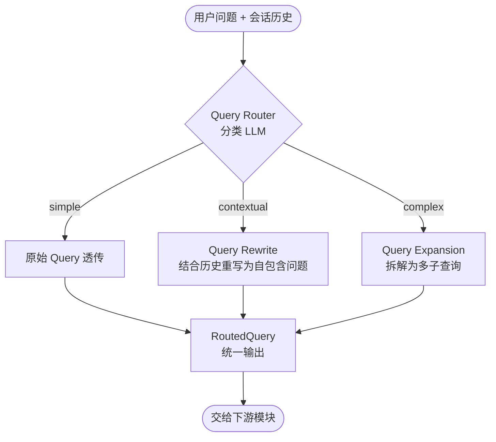

# Query 路由处理设计文档 — Query Router

> 版本：v1.1
> 日期：2026-08-08
> 项目：ai-assistant（Spring Boot 3.4 + Spring AI 1.1）
> 范围：本文档仅定义 Query 路由处理本身；向量检索、RAG 召回、重排、回答生成等后续环节由对应设计文档覆盖。

---

## 1. 概述

### 1.1 目标

当用户发送一条消息时，系统并不是简单地把原始文本直接交给下游，而是先经过**Query Router（查询路由器）**模块，根据问题特征选择不同的预处理策略，将原始问题转化为下游可直接消费的标准查询列表。本文档仅聚焦路由阶段本身：问题分类、三种路由策略（原始 Query / Query Rewrite / Query Expansion）、统一输出结构、模块代码组织与异常降级。

### 1.2 整体流程（Mermaid 图）



### 1.3 技术栈

| 层次 | 技术 | 说明 |
|------|------|------|
| 路由分类 | DeepSeek Chat | 通过 Structured Output 输出分类结果 |
| Query Rewrite | DeepSeek Chat | 结合会话历史重写为自包含问题 |
| Query Expansion | DeepSeek Chat | 生成多个互补子查询 |
| 结构化输出 | Spring AI `BeanOutputFormat` | 把模型输出直接绑定为 Java Bean |
| 历史消息 | `chat_message` 表（已有） | 通过 MyBatis-Plus 加载最近 N 轮 |

---

## 2. 问题类型定义

### 2.1 三类问题对比

| 类型 | 标识 | 特征 | 路由策略 | 示例 |
|------|------|------|----------|------|
| 简单问题 | `simple` | 语义完整、无指代、无需历史即可理解 | 原始 Query 透传 | "杭州今天天气怎么样？" |
| 上下文问题 | `contextual` | 含代词（它/这个/那个）、省略主语、强依赖上一轮 | Query Rewrite：结合历史重写为自包含问题 | 上轮："帮我介绍下 Spring AI" → 当前："它支持向量库吗？" |
| 复杂/模糊问题 | `complex` | 问题宽泛、多意图、关键词不明确、需多角度展开 | Query Expansion：拆解为 2~4 个互补子查询 | "怎么做好一个 AI 助手？" |

### 2.2 complex 判断标准

出现以下任一特征倾向判为 `complex`：

- 含"怎么做/如何/最佳实践/对比/区别/原理"等开放性关键词
- 过短且主题模糊（如 < 6 个字，例："讲讲 Java"）
- 明显包含多个子意图（如"介绍下 Redis 并说说和 Memcached 区别及应用场景"）
- 需要跨多个主题/角度综合作答

---

## 3. Query Router 分类器设计

### 3.1 分类 Prompt

```
你是一个查询分类器。根据用户当前问题及对话历史，判断问题属于以下三类之一：

1. simple：问题语义完整，独立可理解，不依赖历史，无歧义。
2. contextual：问题包含代词、省略或指代上文内容，必须结合历史才能明确含义。
3. complex：问题复杂、模糊、宽泛、包含多个子意图，或需要多角度回答。

输出严格的 JSON，不要任何解释：
{
  "type": "simple | contextual | complex",
  "reason": "分类理由，一句话"
}
```

### 3.2 分类器输入

| 字段 | 来源 | 说明 |
|------|------|------|
| `currentQuery` | 用户当前输入文本 | 必填 |
| `recentHistory` | 最近 N 轮（建议 3~5 轮）`chat_message` 记录 | 拼接为 `User: ...\nAssistant: ...` 格式 |

### 3.3 Java 结构

```java
public enum QueryType {
    SIMPLE("simple"),
    CONTEXTUAL("contextual"),
    COMPLEX("complex");
    // ...
}

@Data
public class QueryRouteResult {
    private QueryType type;
    private String reason;
}
```

分类调用示例（使用 Spring AI structured output）：

```java
QueryRouteResult result = chatModel.prompt(classifyPrompt)
        .options(DeepSeekChatOptions.builder().temperature(0.0).build())
        .outputFormat(BeanOutputFormat.outputFormat(QueryRouteResult.class))
        .call()
        .entity();
```

---

## 4. 三类路由策略详解

### 4.1 simple → 原始 Query 透传（Passthrough）

- **动作**：不做任何改写，直接把原始问题作为唯一查询输出。
- **理由**：简单问题改写会引入语义漂移且浪费 token，透传最高效。
- **输出**：`queries = [originalQuery]`（长度为 1 的列表）

### 4.2 contextual → Query Rewrite（独立问题重写）

#### 目标

把依赖上下文的残缺问题改写为**一个语义自包含、独立成立**的问题，消除代词与省略，使其在脱离对话历史后仍能完整表达用户意图。

#### Rewrite Prompt

```
你是一个查询重写器。根据对话历史，把用户当前的问题改写为一个独立、完整、自包含的问题，使其在没有上下文的情况下也能被准确理解。

要求：
- 仅输出改写后的问题文本，不要任何解释、不要引号、不要前缀。
- 保持原问题意图，不要添加额外信息。
- 替换所有代词（它/这个/那个/他/她/上述/上文 等）为具体指向的实体。
- 补全省略的主语/宾语。

对话历史：
{recentHistory}

用户当前问题：{currentQuery}

改写后的问题：
```

#### 输入 / 输出示例

| 输入 | 输出 |
|------|------|
| 历史：介绍下 Spring AI<br/>当前：它支持哪些向量库？ | Spring AI 支持哪些向量库？ |
| 历史：我买了个 Mac mini M4<br/>当前：配什么显示器好？ | Mac mini M4 配什么显示器好？ |

#### 输出结构

```java
@Data
public class RewriteResult {
    private String rewrittenQuery;
}
```

最终 `queries = [rewrittenQuery]`。

### 4.3 complex → Query Expansion（多子查询扩展）

#### 目标

将宽泛、模糊或包含多意图的单一问题拆解为 **2~4 个互补、具体、互不重复的子查询**，从不同角度覆盖用户真实意图，交给下游模块做更全面的处理。

#### Expansion Prompt

```
你是一个查询扩展器。用户的问题可能比较宽泛、模糊或包含多个意图。请将其拆解为 2~4 个具体、明确、互不重复的子问题，分别覆盖原问题的不同角度。

要求：
- 子问题之间不重叠、不冗余，共同覆盖原问题核心意图。
- 每个子问题应具体明确，避免再次出现模糊表述。
- 输出严格 JSON，不要任何解释。

输出格式：
{
  "queries": ["子问题1", "子问题2", "子问题3"],
  "reason": "拆解思路，一句话"
}

用户问题：{currentQuery}
```

#### 输入 / 输出示例

| 输入 | 输出 queries |
|------|--------------|
| 怎么做好一个 AI 助手？ | ["AI 助手的系统架构如何设计？", "AI 助手如何管理多轮对话上下文？", "AI 助手常见的安全与对齐问题有哪些？", "评估 AI 助手回答质量的方法有哪些？"] |
| 讲讲 Redis | ["Redis 的核心数据结构有哪些？", "Redis 的持久化机制 RDB 和 AOF 有什么区别？", "Redis 常见应用场景有哪些？", "Redis 集群与高可用方案原理是什么？"] |

#### 输出结构

```java
@Data
public class ExpansionResult {
    private List<String> queries; // 2~4 条
    private String reason;
}
```

---

## 5. 统一输出结构 RoutedQuery

无论分类为何种类型，Router 统一输出一个 `RoutedQuery` 对象，作为路由阶段对下游的唯一交付物。

```java
@Data
@Builder
public class RoutedQuery {
    private QueryType type;               // simple / contextual / complex
    private String originalQuery;         // 用户原始问题（原样保留）
    private List<String> queries;         // 路由处理后的查询列表（1~4 条）
    private String routeReason;           // 分类/拆解理由，便于日志与调试
    private Long sessionId;               // 关联 chat_session.id
    private Long userId;                  // 用户 id
}
```

### 5.1 queries 映射关系

| type | queries 来源 | queries 数量 |
|------|--------------|--------------|
| simple | `[originalQuery]` | 1 |
| contextual | `[rewrittenQuery]` | 1 |
| complex | expansionResult.queries | 2~4 |

> 下游模块（如检索、回答生成等）从 `queries` 读取要处理的查询集合，从 `originalQuery` 读取用户原始提问，不感知具体路由策略。

---

## 6. 模块代码结构设计

### 6.1 包结构

```
com.ecarx.aiassistant.
└── query/
    ├── QueryRouterService.java            // 路由主服务（对外唯一入口）
    ├── QueryClassifier.java               // 分类器
    ├── QueryRewriter.java                 // contextual 重写器
    ├── QueryExpander.java                 // complex 扩展器
    ├── enums/
    │   └── QueryType.java
    └── model/
        ├── QueryRouteResult.java
        ├── RewriteResult.java
        ├── ExpansionResult.java
        └── RoutedQuery.java
```

### 6.2 核心接口

```java
public interface QueryRouterService {
    /**
     * 路由入口
     *
     * @param sessionDbId chat_session 数据库主键，用于加载历史消息
     * @param userId      用户 id
     * @param originalQuery 用户当前输入
     * @return 路由结果 RoutedQuery，下游消费 queries 字段即可
     */
    RoutedQuery route(Long sessionDbId, Long userId, String originalQuery);
}
```

### 6.3 主流程伪代码

```java
public RoutedQuery route(Long sessionDbId, Long userId, String originalQuery) {
    // 1. 加载最近 N 轮历史
    List<ChatMessage> history = loadRecentHistory(sessionDbId, 5);
    String historyText = formatHistory(history);

    // 2. 分类
    QueryRouteResult route = classifier.classify(originalQuery, historyText);

    // 3. 按类型分发处理
    List<String> queries = switch (route.getType()) {
        case SIMPLE -> List.of(originalQuery);
        case CONTEXTUAL -> {
            String rewritten = rewriter.rewrite(originalQuery, historyText);
            yield List.of(rewritten);
        }
        case COMPLEX -> expander.expand(originalQuery).getQueries();
    };

    return RoutedQuery.builder()
            .type(route.getType())
            .originalQuery(originalQuery)
            .queries(queries)
            .routeReason(route.getReason())
            .sessionId(sessionDbId)
            .userId(userId)
            .build();
}
```

---

## 7. Prompt 管理

分类 / 重写 / 扩展三个 Prompt 抽为独立资源文件，便于调优与热更新：

```
src/main/resources/prompts/query/
├── classify.st
├── rewrite.st
└── expand.st
```

通过 Spring `Resource` 加载，使用简单占位符（`{recentHistory}`、`{currentQuery}`）替换：

```java
@Value("classpath:prompts/query/classify.st")
private Resource classifyTemplate;
```

---

## 8. 调用位置

在聊天消息处理链路中，Query Router 位于"用户消息入库后、下游处理前"：

```
用户发消息
  → 保存 user 消息到 chat_message（已有能力）
  → QueryRouterService.route(...)   ← 本模块
  → 把返回的 RoutedQuery 交给下游模块
```

> 注：下游如何消费 `RoutedQuery.queries`（检索、重排、回答生成、流式输出等）由各自的设计文档定义，本文档不展开。

可选的路由开关：可在 `chat_session` 上扩展字段或基于会话类型控制是否启用路由；关闭时直接返回 `RoutedQuery` with type=simple、queries=[originalQuery]。

---

## 9. 日志与可观测性

`RoutedQuery` 产生后记录一条 INFO 日志，便于分析与调优：

```
[QueryRouter] sessionId=123, userId=456, type=complex,
 original="怎么做好AI助手", queriesCount=4,
 reason="问题宽泛含多意图", cost=520ms
```

核心观测指标：

| 指标 | 说明 |
|------|------|
| `router.classify.count` | 各类型计数（simple / contextual / complex） |
| `router.latency.ms` | 路由整体耗时（含分类 + rewrite/expand 的 LLM 调用） |
| `router.expansion.queries.avg` | complex 问题平均拆出的子查询数 |
| `router.fallback.count` | 分类/重写/扩展失败回退到原始 Query 的次数 |

---

## 10. 异常与降级策略

| 异常场景 | 降级策略 |
|----------|----------|
| 分类 LLM 调用超时/失败 | 按 `simple` 处理，返回 `[originalQuery]` |
| Rewrite 返回空或超过长度上限（>200 字） | 回退为 `[originalQuery]` |
| Expansion 返回 0 条或超过上限（>6 条） | 截断或补充为 `[originalQuery]` |
| JSON 解析失败（模型输出不规范） | 重试 1 次（temperature=0），仍失败则降级 simple |
| 历史为空（会话第一轮） | 直接判定 simple，跳过 rewrite/expand |

所有降级均打印 WARN 日志，记录失败原因，便于后续 Prompt 优化。

---

## 11. 附录：术语表

| 术语 | 含义 |
|------|------|
| Query Router | 查询路由器，本模块核心，按问题类型分发到不同预处理策略 |
| Query Rewrite | 查询重写，把依赖上下文的问题改写为自包含问题 |
| Query Expansion | 查询扩展，把复杂问题拆分为多个互补子查询 |
| Passthrough | 透传策略，不对原始 query 做任何改动 |
| RoutedQuery | 路由阶段的统一输出对象，下游消费的标准结构 |
