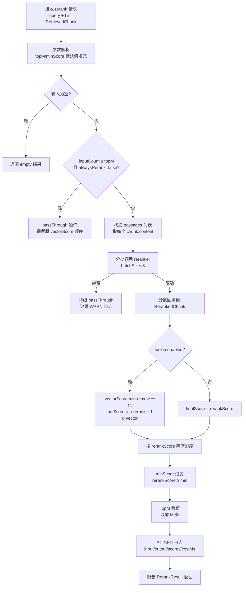

# Rerank 重排 — 系统分析文档

> 版本：v1.0  
> 日期：2026-08-09  
> 项目：ai-assistant（Spring Boot 3.4 + Spring AI 1.1）

---

## 1. 系统概述

本系统实现了 RAG（Retrieval-Augmented Generation）链路中**Rerank 重排**环节。向量检索阶段基于 Bi-Encoder（bge-m3）产出的向量相似度召回 TopK 候选片段，由于双编码器各自独立编码、存在语义偏差，TopK 结果中真正与用户原始问题最相关的片段未必排在最前。Rerank 模块使用 **Cross-Encoder（bge-reranker-v2-m3）** 对候选片段逐一与用户原始问题做联合编码、精细打分，重新排序并 TopM 截断，把最相关的片段排在前面交给下游上下文组装与答案生成模块。

### 1.1 在整体 RAG 链路中的位置

```
用户提问
    │
    ▼
Query Router（已实现）
    │ RoutedQuery.queries (1~4 条)
    ▼
向量检索 & TopK 召回（已实现）
    │ List<RetrievedChunk>（已合并去重、按 vectorScore 降序、TopN 截断）
    ▼
┌─────────────────────────────────────────────┐
│  本模块：Rerank 重排                           │  ← 本文档覆盖范围
│  ├─ 数量检查（空/过少直接透传）                 │
│  ├─ 分批调用 bge-reranker-v2-m3 服务           │
│  ├─ 可选分数融合（rerank + vector 加权）        │
│  ├─ 按 rerankScore 降序重排                    │
│  ├─ minScore 过滤 + TopM 截断                  │
│  └─ 异常降级为向量原序                          │
│  输出: RerankResult → List<RetrievedChunk>     │
└───────────────┬─────────────────────────────┘
                │ List<RetrievedChunk>（rerank 后，按相关性降序）
                ▼
┌─────────────────────────────────────────────┐
│  下游模块（待实现）                            │
│  ├─ TopN 最终截断（token 预算）                │
│  ├─ Context 组装（编号引用 + 结构化）           │
│  └─ Prompt 组装（RAG 系统提示 + 注入上下文）    │
└─────────────────────────────────────────────┘
```

### 1.2 技术栈

| 层次 | 技术选型 | 版本 | 说明 |
|------|---------|------|------|
| 框架 | Spring Boot | 3.4.4 | Java 21 |
| HTTP 客户端 | Spring Web `RestClient` | Spring 6.x | 同步阻塞 HTTP，内置 JSON 序列化 |
| Rerank 模型 | BAAI `bge-reranker-v2-m3` | — | Cross-Encoder，中英双语，输出 0~1 相关性分数 |
| 模型部署 | 本地 Python FastAPI 服务 | — | 封装 `FlagEmbedding.FlagReranker`，暴露 `POST /rerank` 接口 |
| 模型地址 | `http://localhost:8000`（默认） | — | 通过配置 `ai.rerank.base-url` 可改 |
| 配置管理 | `@ConfigurationProperties` | — | 所有参数 yaml 可配，热改需重启 |
| Bean 条件装配 | `@ConditionalOnProperty` | — | 开关关闭时零开销，不创建 HTTP 客户端 Bean |
| JSON 序列化 | Jackson（Spring Boot 默认） | — | 请求/响应体自动序列化/反序列化 |

### 1.3 核心设计目标

1. **可插拔开关**：通过 `ai.rerank.enabled` 控制，关闭时整个模块零开销（不创建 RestClient/服务 Bean）
2. **服务故障不阻断主链路**：HTTP 超时、500、服务未启动等任何异常都降级为按 vectorScore 透传，不抛到上层
3. **分批调用控延迟**：默认 batchSize=8，避免单次请求 passages 过长导致 Python 服务 OOM 或超时
4. **透传优化**：输入候选数 ≤ topM 且 alwaysRerank=false 时直接透传，省一次模型调用
5. **分数融合可选**：支持 rerank 分数 + 归一化 vectorScore 加权融合，提供稳定性兜底
6. **query 用原始问题**：rerank 使用用户原始问题（非扩展子查询），衡量候选片段对用户真实意图的相关性
7. **可观测**：每次 rerank 打印结构化 INFO 日志，记录 input/output/分数范围/耗时/batch 数/是否透传
8. **可扩展**：`RerankService` 接口抽象，未来可接入 Cohere/Jina/LLM 打分等实现

---

## 2. 整体架构

### 2.1 处理流程图



### 2.2 包结构

```
src/main/java/org/grayray/aiassistant/rag/
└── rerank/
    ├── RerankService.java                    # 重排服务接口（对外契约）
    ├── RerankProperties.java                 # 配置属性类（ai.rerank.*）
    ├── RerankConfig.java                     # 条件装配配置类（Bean 开关）
    ├── RerankResult.java                     # 重排结果 BO（含 static 工厂方法）
    ├── RerankedChunk.java                    # 重排后片段 BO（扩展 RetrievedChunk）
    ├── impl/
    │   ├── BgeRerankServiceImpl.java         # bge-reranker-v2-m3 主实现
    │   └── NoopRerankServiceImpl.java        # 空实现（开关关闭时使用）
    └── client/
        └── BgeRerankerClient.java            # Python rerank 服务 HTTP 客户端

src/main/java/org/grayray/aiassistant/chat/
└── service/impl/
    └── ChatServiceImpl.java                  # [集成] send/sendStream 中调用 rerank
```

### 2.3 数据流时序

```
ChatServiceImpl         RerankService(BgeImpl)       BgeRerankerClient      Python Rerank 服务
      │                          │                            │                     │
      │ rerank(query, chunks)    │                            │                     │
      │─────────────────────────▶│                            │                     │
      │                          │ 空/≤topM? → passThrough    │                     │
      │                          │                            │                     │
      │                          │ for batch in batches:      │                     │
      │                          │   computeScores(q, batch)  │                     │
      │                          │───────────────────────────▶│                     │
      │                          │                            │ POST /rerank        │
      │                          │                            │ {query, passages}   │
      │                          │                            │────────────────────▶│
      │                          │                            │                     │ 推理
      │                          │                            │◀────────────────────│
      │                          │                            │ {scores: [...]}     │
      │                          │◀───────────────────────────│                     │
      │                          │                            │                     │
      │                          │ 分数回填 + 融合 + 排序      │                     │
      │                          │ minScore 过滤 + TopM 截断   │                     │
      │◀───── RerankResult ──────│                            │                     │
```

---

## 3. 模块详细分析

### 3.1 配置层

#### 3.1.1 RerankProperties

- **位置**：`rag/rerank/RerankProperties.java`
- **前缀**：`ai.rerank`
- **注册方式**：`@Component` + `@ConfigurationProperties`
- **嵌套类**：`Fusion`（分数融合配置）

| 配置项 | 类型 | 默认值 | 说明 |
|--------|------|--------|------|
| `enabled` | boolean | `false` | 总开关：true 启用 bge-reranker，false 使用 Noop 透传 |
| `model` | String | `"bge-reranker-v2-m3"` | 模型名称（仅用于日志标识，HTTP 请求中不传递） |
| `baseUrl` | String | `"http://localhost:8000"` | Python rerank 服务基础 URL |
| `topM` | int | `4` | 重排后返回条数（TopM 截断上限） |
| `minScore` | double | `0.3` | 最低 rerank 分数阈值（0~1，含），低于此值过滤 |
| `batchSize` | int | `8` | 单次 HTTP 调用的 passage 批量大小 |
| `timeoutMs` | long | `5000` | HTTP 连接+读取超时（毫秒） |
| `alwaysRerank` | boolean | `false` | 输入候选数 ≤ topM 时是否仍执行重排 |
| `fusion.enabled` | boolean | `false` | 是否开启向量分数加权融合 |
| `fusion.alpha` | double | `0.7` | rerank 分数权重，vector 权重 = 1 - α |

**配置示例（application.yaml）**：

```yaml
ai:
  rerank:
    enabled: false                  # 总开关
    model: bge-reranker-v2-m3
    base-url: http://localhost:8000
    top-m: 4
    min-score: 0.3
    batch-size: 8
    timeout-ms: 5000
    always-rerank: false
    fusion:
      enabled: false
      alpha: 0.7
```

#### 3.1.2 RerankConfig — 条件 Bean 装配

- **位置**：`rag/rerank/RerankConfig.java`
- **机制**：`@Configuration` + `@ConditionalOnProperty`，根据 `ai.rerank.enabled` 的值决定注册哪一组 Bean

**Bean 注册规则**：

| enabled 值 | 注册的 Bean | 说明 |
|-----------|-------------|------|
| `true` | `bgeRerankerRestClient`（RestClient） | HTTP 客户端，连接/读取超时均取 `timeoutMs` |
| `true` | `bgeRerankerClient`（BgeRerankerClient） | 封装 RestClient 的业务客户端 |
| `true` | `bgeRerankService`（BgeRerankServiceImpl，@Primary） | 重排主实现 |
| `false`（或缺失） | `noopRerankService`（NoopRerankServiceImpl，@Primary） | 空实现，透传 |

**关键设计**：
- `@ConditionalOnProperty(..., matchIfMissing = true)` 在 Noop Bean 上，表示配置缺失时默认注册 Noop（安全降级）
- BgeRerankServiceImpl 通过 `new` 手动构造（`return new BgeRerankServiceImpl(...)`），不走组件扫描，避免未启用时创建
- 启用时打印醒目的启动 Banner（多行 `===` 框），列出所有关键配置项，运维侧一眼能看到 rerank 是否生效
- `@PostConstruct logConfig()` 在关闭时打一条 INFO 说明模块未启用

**RestClient 超时配置细节**：
```java
SimpleClientHttpRequestFactory factory = new SimpleClientHttpRequestFactory();
factory.setConnectTimeout((int) properties.getTimeoutMs());  // 连接超时
factory.setReadTimeout((int) properties.getTimeoutMs());     // 读取超时
```
注意：`SimpleClientHttpRequestFactory` 基于 JDK `HttpURLConnection`，连接超时和读取超时使用同一个值（5000ms）。

### 3.2 服务接口

#### 3.2.1 RerankService 接口

- **位置**：`rag/rerank/RerankService.java`

```java
public interface RerankService {
    // 全参方法
    RerankResult rerank(String query, List<RetrievedChunk> chunks,
                        Integer topM, Double minScore);

    // 便捷方法（使用配置默认 topM/minScore）
    default RerankResult rerank(String query, List<RetrievedChunk> chunks) {
        return rerank(query, chunks, null, null);
    }

    // 可用性标识：true=Bge 实际实现，false=Noop 透传
    boolean isAvailable();
}
```

**isAvailable() 的作用**：
- 调用方（ChatServiceImpl）在调用 rerank 前先判断 `isAvailable()`，false 则直接跳过整个 rerank 步骤（省一次函数调用和对象构造）
- Noop 实现始终返回 false，Bge 实现始终返回 true

#### 3.2.2 两个实现类对比

| 维度 | NoopRerankServiceImpl | BgeRerankServiceImpl |
|------|----------------------|---------------------|
| 触发条件 | `enabled=false` 或缺失 | `enabled=true` |
| isAvailable() | `false` | `true` |
| 是否调用模型 | 否 | 是（HTTP 调用 Python 服务） |
| 返回结果 | `RerankResult.passThrough()`，rerankScore 填充原 vectorScore | 实际打分重排 |
| 性能开销 | 接近 0（一次 List 转换） | 网络 IO + 模型推理（50~500ms） |
| 异常场景 | 无 | HTTP 异常时降级为 passThrough |

### 3.3 数据模型

#### 3.3.1 RerankedChunk（重排后片段）

- **位置**：`rag/rerank/RerankedChunk.java`
- **继承关系**：不使用 extends，而是**复制 RetrievedChunk 全部字段** + 追加 rerank 特有字段
  - 原因：跨包 BO 独立，避免 Liskov 替换引发的隐式类型问题；两个 BO 服务于不同阶段
  - 代价：字段重复，转换时需要手动映射（由 `RerankResult.toRerankedChunk()` 工厂方法统一处理）

| 字段 | 类型 | 来源 | 说明 |
|------|------|------|------|
| `chunkId` | String | RetrievedChunk | 格式 `doc_{documentId}_chunk_{chunkIndex}` |
| `documentId` | Long | RetrievedChunk | 所属文档 id |
| `documentName` | String | RetrievedChunk | 文档原始文件名 |
| `chunkIndex` | Integer | RetrievedChunk | 切片序号 |
| `totalChunks` | Integer | RetrievedChunk | 文档总切片数 |
| `chapterIndex` | Integer | RetrievedChunk | 章节序号 |
| `chapterTitle` | String | RetrievedChunk | 章节标题 |
| `content` | String | RetrievedChunk | 切片文本 |
| `tokenCount` | Integer | RetrievedChunk | token 估算数 |
| `matchedQuery` | String | RetrievedChunk | 命中的原始 query（多查询扩展时最高分的那条） |
| `hitCount` | int | RetrievedChunk | 被多少子查询命中 |
| `vectorScore` | double | RetrievedChunk.score | 原向量检索分数，保留用于融合/调试 |
| `rerankScore` | double | reranker 返回 | rerank 相关性分数（0~1），或融合后的最终分数 |

**字段对应关系**：`RerankedChunk.vectorScore = RetrievedChunk.score`；`RerankedChunk.rerankScore = reranker 打分值`。

#### 3.3.2 RerankResult（重排结果）

- **位置**：`rag/rerank/RerankResult.java`

| 字段 | 类型 | 说明 |
|------|------|------|
| `chunks` | `List<RerankedChunk>` | 重排后片段列表（按 rerankScore 降序、已截断、已过滤） |
| `totalInputCount` | int | 输入候选总数 |
| `outputCount` | int | 最终输出数量 |
| `topScore` | double | 输出列表中最高分（第一条） |
| `bottomScore` | double | 输出列表中最低分（最后一条） |
| `costMs` | long | 重排总耗时（毫秒，含网络 + 模型推理 + 排序） |
| `rerankerModel` | String | 模型名（透传场景为 `"none"`） |
| `passThrough` | boolean | 是否透传（未实际调用 reranker） |

**静态工厂方法**：

| 方法 | 使用场景 | 行为 |
|------|---------|------|
| `empty(inputCount, startMs, model)` | 输入为 0 条 / 全部被过滤 | chunks 为空列表，topScore=bottomScore=0 |
| `passThrough(chunks, startMs, model)` | 开关关闭、输入≤topM、HTTP 异常降级 | 将 RetrievedChunk 原样转为 RerankedChunk，rerankScore 填原 vectorScore，passThrough=true |

**工具方法**：
- `toRerankedChunk(RetrievedChunk c, double rerankScore)` — 统一的字段映射转换，避免散落在多处
- `isEmpty()` — 判断 chunks 是否为空

**passThrough 方法的关键细节**：
```java
.topScore(ranked.isEmpty() ? 0.0 : ranked.get(0).getVectorScore())
.bottomScore(...)
```
透传时 topScore/bottomScore 使用 `vectorScore` 而非 `rerankScore`，因为此时 rerankScore 被填充为 vectorScore 值，但语义上仍是向量分数。

### 3.4 HTTP 客户端

#### 3.4.1 BgeRerankerClient

- **位置**：`rag/rerank/client/BgeRerankerClient.java`
- **协议约定**：

| 项 | 值 |
|----|-----|
| HTTP 方法 | POST |
| 路径 | `/rerank` |
| Content-Type | `application/json` |
| 请求体 | `{"query": "用户问题", "passages": ["片段1", "片段2", ...]}` |
| 响应体 | `{"scores": [0.95, 0.72, ...]}`（与 passages 下标一一对应） |
| 异常 | HTTP 4xx/5xx / 超时 / 响应为 null → 抛 `RestClientException` |

**内部 DTO（static 嵌套类，包私有）**：

```java
@Data @Builder @NoArgsConstructor @AllArgsConstructor
@JsonInclude(JsonInclude.Include.NON_NULL)
static class RerankRequest {
    private String query;
    private List<String> passages;
}

@Data @NoArgsConstructor @AllArgsConstructor
static class RerankResponse {
    private List<Double> scores;
}
```

- 请求/响应 DTO 均设计为 `static` 内部类，不对外暴露，符合"客户端内部细节不泄漏"原则
- `@JsonInclude(NON_NULL)` 防止序列化 null 字段

**调用核心代码**：
```java
RerankResponse resp = restClient.post()
    .uri("/rerank")
    .contentType(MediaType.APPLICATION_JSON)
    .body(req)
    .retrieve()
    .body(RerankResponse.class);

if (resp == null || resp.getScores() == null) {
    throw new RestClientException("rerank 服务返回为空");
}
```

**日志截断**：query 超过 60 字符时截断（`truncate(query, 60)`），避免长 query 撑爆日志。

### 3.5 重排主服务

#### 3.5.1 BgeRerankServiceImpl 核心流程

- **位置**：`rag/rerank/impl/BgeRerankServiceImpl.java`
- **注入**：通过 `RerankConfig` 手动 `new` 构造，注入 `RerankProperties` + `BgeRerankerClient`
- **方法**：`rerank(query, chunks, topM, minScore)` 共 182 行，包含 6 个关键节点

**节点 1 — 参数解析与默认值填充**
```java
int inputCount = chunks == null ? 0 : chunks.size();
int m = topM != null ? topM : properties.getTopM();
double min = minScore != null ? minScore : properties.getMinScore();
String modelName = properties.getModel();
```
方法入参 topM/minScore 优先于配置默认值，支持调用方临时覆盖（ChatServiceImpl 当前未使用此能力，保留扩展性）。

**节点 2 — 空输入快速返回**
```java
if (CollectionUtils.isEmpty(chunks)) {
    return RerankResult.empty(0, start, modelName);
}
```
chunks 为 null 或空列表时直接返回 empty 结果，不进入后续逻辑。

**节点 3 — 透传优化**
```java
if (inputCount <= m && !properties.isAlwaysRerank()) {
    return RerankResult.passThrough(chunks, start, modelName);
}
```
设计意图：
- 当上游召回数量本身就不超过 topM（例如向量检索 finalTopN=4，rerank topM=4），rerank 没有筛选空间，直接透传省一次模型调用
- `alwaysRerank=true` 时跳过此优化，强制重排（用于效果对比测试/对排序精度要求极高的场景）

**节点 4 — 分批调用 reranker（含异常降级）**
```java
List<String> passages = chunks.stream().map(RetrievedChunk::getContent).collect(toList());
scores = batchRerank(query, passages);
batchCount = (int) Math.ceil((double) passages.size() / properties.getBatchSize());
```
异常处理：
```java
catch (Exception e) {
    log.warn("[Rerank] 调用 reranker 失败，降级为向量检索原序。model={}, err={}", modelName, e.getMessage());
    return RerankResult.passThrough(chunks, start, modelName);
}
```
- catch 的是 `Exception`，即任何异常（`RestClientException`、`NullPointerException`、序列化错误等）都降级
- 降级时直接返回 passThrough，主链路零中断

**分批逻辑（batchRerank 私有方法）**：
```java
for (int i = 0; i < passages.size(); i += batchSize) {
    int end = Math.min(i + batchSize, passages.size());
    List<String> batch = passages.subList(i, end);
    List<Double> batchScores = rerankerClient.computeScores(query, batch);
    // 返回数量不匹配时补齐为 0
    if (batchScores.size() != batch.size()) {
        while (batchScores.size() < batch.size()) batchScores.add(0.0);
    }
    allScores.addAll(batchScores);
}
```
- 使用 `List.subList()` 零拷贝视图，不额外分配数组
- 返回数量少于请求数量时，缺失位置填充 0.0（对应片段会因分数低排在末尾或被 minScore 过滤），保证 scores 与 passages 下标对齐
- 返回数量多于请求数量时，多出来的分数被忽略（`allScores` 最终长度为 passages.size()）

**节点 5 — 分数回填 + 可选融合**
```java
for (int i = 0; i < inputCount; i++) {
    RetrievedChunk c = chunks.get(i);
    double score = scores.get(i);
    double finalScore = score;
    if (properties.getFusion() != null && properties.getFusion().isEnabled()) {
        double normalizedVectorScore = normalizeVectorScore(chunks, i);
        double alpha = properties.getFusion().getAlpha();
        finalScore = alpha * score + (1 - alpha) * normalizedVectorScore;
    }
    ranked.add(RerankResult.toRerankedChunk(c, finalScore));
}
```

**向量分数归一化（normalizeVectorScore）**：
```java
double min = chunks.stream().mapToDouble(RetrievedChunk::getScore).min().orElse(0.0);
double max = chunks.stream().mapToDouble(RetrievedChunk::getScore).max().orElse(1.0);
if (max - min < 1e-9) return 1.0;  // 所有分数相等时归一化为 1
return (chunks.get(index).getScore() - min) / (max - min);
```
- 采用 min-max 归一化，将向量分数映射到 [0,1] 区间，与 rerank 分数量纲一致
- 注意：每次调用 normalizeVectorScore 都会遍历整个 chunks 列表求 min/max，存在重复遍历。当前 chunks 规模小（最多几十个），性能可忽略；大规模场景下应提前计算一次 min/max

**节点 6 — 过滤 + 排序 + TopM 截断**
```java
List<RerankedChunk> filtered = ranked.stream()
    .filter(c -> c.getRerankScore() >= min)
    .sorted(Comparator.comparingDouble(RerankedChunk::getRerankScore).reversed())
    .collect(toList());

List<RerankedChunk> resultList = filtered.size() > m
    ? new ArrayList<>(filtered.subList(0, m))
    : filtered;
```
- 过滤在排序之前（减少排序元素数量，但由于 stream 是惰性的，filter+sorted 实际会先 filter 再 sort）
- `new ArrayList<>(subList(0, m))` 是关键：`subList` 返回原 List 的视图，直接持有会阻止 GC 回收被截断部分；包一层新 ArrayList 切断引用
- TopM 截断发生在过滤之后，所以 outputCount ≤ M

**日志输出**：
```java
log.info("[Rerank] model={}, input={}, output={}, topScore={}, bottomScore={}, "
       + "costMs={}, passThrough={}, batches={}", ...);
```
topScore/bottomScore 使用 `String.format("%.4f", ...)` 保留 4 位小数，避免浮点数噪声。

#### 3.5.2 isAvailable 实现
```java
@Override
public boolean isAvailable() {
    return true;
}
```
Bge 实现只要 Bean 被注册（意味着 enabled=true），即认为可用。当前没有在启动时做健康检查（如 ping Python 服务）。

### 3.6 空实现

#### 3.6.1 NoopRerankServiceImpl

- **位置**：`rag/rerank/impl/NoopRerankServiceImpl.java`
- **实现极简**：`rerank()` 直接调用 `RerankResult.passThrough(chunks, start, "none")`
- **isAvailable() 返回 false**
- **不使用 @Service 注解**：完全由 `RerankConfig` 通过 `@ConditionalOnProperty` 注册，避免组件扫描误注册

### 3.7 与对话服务集成

#### 3.7.1 ChatServiceImpl 集成点（同步 send 与流式 sendStream 逻辑完全一致）

**步骤 6.5 — Rerank 重排**（`ChatServiceImpl.java:125-140` 及 `:217-232`）：

```java
// 6.5 Rerank 重排
if (searchResult != null && rerankService.isAvailable()) {
    try {
        RerankResult rerankResult = rerankService.rerank(dto.getContent(), searchResult.getChunks());
        searchResult = VectorSearchResult.builder()
                .chunks(toRetrievedChunks(rerankResult.getChunks()))
                .totalHitCount(searchResult.getTotalHitCount())
                .queryCount(searchResult.getQueryCount())
                .costMs(searchResult.getCostMs() + rerankResult.getCostMs())
                .build();
        log.info("[ChatService] Rerank 完成: input={}, output={}, topScore={}, costMs={}", ...);
    } catch (Exception e) {
        log.warn("[ChatService] Rerank 异常，使用原始检索结果: {}", e.getMessage());
    }
}
```

**关键设计点**：

1. **前置守卫**：`searchResult != null && rerankService.isAvailable()` —— 检索无结果或 Noop 模式下直接跳过，零开销
2. **query 使用用户原始问题**：`dto.getContent()`（或 `content` 变量），即用户输入的原始问题，不是扩展子查询。这是与设计文档一致的：rerank 衡量的是"候选片段对用户真实问题的相关性"
3. **双层异常防护**：虽然 BgeRerankServiceImpl 内部已做 try-catch 降级，但 ChatService 外层再包一层 try-catch，防止任何未预料的异常（如 toRetrievedChunks 空指针）阻断对话
4. **结果回写 VectorSearchResult**：rerank 后重新构造 VectorSearchResult，chunks 转换回 RetrievedChunk 类型，costMs 累加检索耗时+重排耗时，保持下游使用一致性
5. **toRetrievedChunks 转换**：将 RerankedChunk 转回 RetrievedChunk，**score 字段使用 rerankScore 覆盖**，下游看到的 score 就是重排后的分数

**toRetrievedChunks 私有方法**（`ChatServiceImpl.java:440-459`）：
```java
private List<RetrievedChunk> toRetrievedChunks(List<RerankedChunk> reranked) {
    List<RetrievedChunk> result = new ArrayList<>(reranked.size());
    for (RerankedChunk c : reranked) {
        result.add(RetrievedChunk.builder()
                .chunkId(c.getChunkId())
                .documentId(c.getDocumentId())
                ... // 字段逐一映射
                .score(c.getRerankScore())  // ★ 用 rerankScore 覆盖 score
                .matchedQuery(c.getMatchedQuery())
                .hitCount(c.getHitCount())
                .build());
    }
    return result;
}
```

**INFO 日志**：
```
[ChatService] Rerank 完成: input=6, output=4, topScore=0.9100, costMs=230
[ChatService] Rerank 完成(stream): input=6, output=4, topScore=0.9100, costMs=230
```
同步和流式分别打印，便于定位延迟来源。

---

## 4. 关键设计决策

### 4.1 条件装配而非运行时 if-else

- **决策**：通过 `@ConditionalOnProperty` 在 Spring 容器层面决定注册 Bge 还是 Noop 实现，而不是在一个 Service 内部读 `enabled` 字段做 if-else
- **理由**：
  - 开关关闭时不创建 RestClient、不建立 HTTP 连接池，真正零开销
  - Bean 不存在，IDE 中搜索不会误引用
  - 启动 Banner 清晰告知当前模式
- **权衡**：切换开关需重启应用（无法热切换），但 rerank 作为基础能力通常不会频繁开关

### 4.2 使用原始 query 而非扩展子查询做 rerank

- **决策**：`rerankService.rerank(dto.getContent(), chunks)` 使用用户原始问题
- **理由**：
  - 交叉编码器衡量的是"文档片段是否回答了用户想问的问题"，原始问题最准确
  - 多查询扩展已经在向量检索阶段从不同角度召回候选，rerank 需要在统一标准下排序
  - 子查询可能引入噪声（扩展 query 是 LLM 生成的，存在偏离原始意图的风险）
- **权衡**：原始 query 可能表述不完整（contextual 类型经重写后更清晰），但 QueryRewriter 产出的是改写后的独立问题，可考虑未来同时传入改写后 query

### 4.3 输入 ≤ topM 时透传（alwaysRerank=false 默认）

- **决策**：`if (inputCount <= m && !alwaysRerank) return passThrough`
- **理由**：
  - 向量检索 finalTopN=6，rerank topM=4，当 finalTopN≤topM（即召回数≤4）时，rerank 只是重新排序，不减少输出，ROI 低
  - 省一次网络 + 模型推理（80~200ms）
  - 配置 `alwaysRerank=true` 可强制 rerank（用于效果对比测试）
- **权衡**：默认 finalTopN=6、topM=4 时，input=6 > topM=4，rerank 总会生效。若配置 finalTopN≤4，则 rerank 默认透传（此时应调小 topM 或开启 alwaysRerank）

### 4.4 双层异常防护

- **决策**：BgeRerankServiceImpl 内部 catch Exception 降级 + ChatServiceImpl 外层再 catch Exception
- **理由**：
  - Bge 内部能处理 HTTP/序列化等已知异常，返回 passThrough（带向量原序）
  - ChatService 外层防止未预料的异常（如空指针、ClassCastError、构造 RerankResult 时的 NPE）
  - 两层保险确保 rerank 故障绝对不会导致对话失败
- **权衡**：外层 catch 会吞掉 Bge 未处理的 Error（如 OOM），这是刻意设计——对话可用性优先

### 4.5 分数融合采用 min-max 归一化而非 z-score

- **决策**：向量分数归一化使用 min-max 到 [0,1]，而非 z-score（标准化）
- **理由**：
  - rerank 分数固定在 [0,1] 区间（cross-encoder 经 sigmoid 输出），min-max 归一化后向量分数也在 [0,1]，量纲对齐
  - z-score 会产生负值，加权融合后可能出现负分，语义不直观
  - min-max 计算简单，无需预计算均值/方差
- **权衡**：min-max 对离群点敏感（一个极高分会把其他分数压到接近 0）；rerank 候选集通常较小（<10 个），影响可接受

### 4.6 返回数量不匹配时补 0 而非抛异常

- **决策**：`batchScores.size() != batch.size()` 时补齐 0.0，不抛异常
- **理由**：
  - Python 服务 bug/版本差异可能导致少返回分数，补 0 让整个流程继续
  - 补 0 的片段自然排在末尾或被 minScore 过滤，不影响优质片段排序
  - 打 WARN 日志便于排查
- **权衡**：静默补 0 可能掩盖 Python 服务问题，应配合告警监控

### 4.7 RerankedChunk 独立于 RetrievedChunk

- **决策**：RerankedChunk 不继承 RetrievedChunk，而是平级独立 BO
- **理由**：
  - 两个 BO 服务于不同阶段，语义不同：RetrievedChunk 的 score 是向量分数，RerankedChunk 同时有 vectorScore 和 rerankScore
  - 继承会导致 `setScore()` 语义混乱，下游使用时容易混淆
  - 通过 `RerankResult.toRerankedChunk()` 工厂方法统一转换，字段映射错误集中在一处
- **权衡**：字段重复，增加了转换代码量，但类型安全收益更大

### 4.8 BgeRerankServiceImpl 手动 new 而非 @Service

- **决策**：BgeRerankServiceImpl 不加 @Service 注解，在 RerankConfig 中通过 `return new BgeRerankServiceImpl(...)` 注册
- **理由**：
  - @Service 会被组件扫描无条件注册，导致即使 enabled=false，BgeRerankServiceImpl 的 Bean 也存在（虽然可能被 @Primary 覆盖）
  - 手动 new 严格控制 Bean 生命周期，仅在 enabled=true 时创建
  - 与 `bgeRerankerRestClient` 的条件 Bean 保持一致，避免依赖找不到的 Bean
- **权衡**：构造注入改为手动传参，但字段用 `final` + `@RequiredArgsConstructor` 保证不可变

---

## 5. 配置参数汇总

### 5.1 Rerank 模块配置

| 配置项 | 默认值 | 说明 |
|--------|--------|------|
| `ai.rerank.enabled` | `false` | 总开关 |
| `ai.rerank.model` | `bge-reranker-v2-m3` | 模型名（日志标识） |
| `ai.rerank.base-url` | `http://localhost:8000` | Python 服务地址 |
| `ai.rerank.top-m` | `4` | 重排后返回条数 |
| `ai.rerank.min-score` | `0.3` | 最低 rerank 分数 |
| `ai.rerank.batch-size` | `8` | 单次批大小 |
| `ai.rerank.timeout-ms` | `5000` | HTTP 超时 |
| `ai.rerank.always-rerank` | `false` | 输入≤topM 时仍强制重排 |
| `ai.rerank.fusion.enabled` | `false` | 分数融合开关 |
| `ai.rerank.fusion.alpha` | `0.7` | rerank 权重（融合时） |

### 5.2 关联配置

| 配置项 | 默认值 | 来源模块 | 关联说明 |
|--------|--------|---------|---------|
| `ai.vector-search.final-top-n` | `6` | 向量检索 | rerank 的输入条数，默认 6 > topM=4，rerank 生效 |
| `ai.vector-search.min-score` | `0.5` | 向量检索 | 向量检索层第一道过滤，rerank 的 minScore=0.3 是第二道过滤 |
| `spring.ai.deepseek.chat.options.model` | `deepseek-v4-flash` | DeepSeek | rerank 使用独立模型，与 chat 模型无关 |

---

## 6. 异常处理与降级策略

| 场景 | 处理位置 | 处理方式 | 返回 | 日志 |
|------|---------|---------|------|------|
| chunks 为 null 或空 | BgeImpl 节点 2 | 返回 empty 结果 | `chunks=[]` | DEBUG |
| 输入数 ≤ topM 且 alwaysRerank=false | BgeImpl 节点 3 | 返回 passThrough | 原序向量结果 | DEBUG |
| HTTP 连接超时 | BgeImpl 节点 4 catch | 降级 passThrough | 原序向量结果 | WARN |
| HTTP 读取超时 | BgeImpl 节点 4 catch | 降级 passThrough | 原序向量结果 | WARN |
| HTTP 4xx/5xx 错误 | BgeImpl 节点 4 catch | 降级 passThrough | 原序向量结果 | WARN |
| 响应体为 null / scores 为 null | BgeRerankerClient | 抛 RestClientException → BgeImpl catch | 原序向量结果 | WARN |
| 单批返回分数数量少于请求 | batchRerank | 缺失位置补 0.0 | 继续执行 | WARN |
| 单批返回分数数量多于请求 | batchRerank | 多余分数被忽略（addAll 受 for 循环控制） | 继续执行 | WARN |
| 所有片段分数 < minScore | BgeImpl 节点 6 | 过滤后 chunks 为空 | `chunks=[]` | INFO |
| 过滤后结果不足 topM | BgeImpl 节点 6 | 返回实际数量 | 实际条数 | INFO |
| ChatService 层未预期异常 | ChatServiceImpl 外层 catch | 使用原始检索结果（rerank 前） | 向量检索原序 | WARN |
| Noop 模式下被调用 | NoopImpl | 直接 passThrough | 原序 | DEBUG |
| fusion 时所有向量分数相同 | normalizeVectorScore | 返回 1.0（归一化边界） | 继续执行 | — |

**设计原则**：
1. rerank 是增强能力而非核心能力，任何异常都不能阻断对话
2. 降级统一使用 `passThrough`，保持返回类型一致
3. 异常区分 DEBUG/WARN/INFO 级别：正常降级路径（空输入/透传优化）用 DEBUG，故障降级用 WARN，结果统计用 INFO
4. BgeImpl 内部 catch 范围是 `Exception` 而非 `RestClientException`，兜底所有异常

---

## 7. 日志与可观测性

### 7.1 启动日志（启用时）

```
============================================================
🔄 RerankService（bge-reranker-v2-m3）已启用
   服务地址    : http://localhost:8000
   模型        : bge-reranker-v2-m3
   topM        : 4
   minScore    : 0.3
   batchSize   : 8
   timeout     : 5000ms
   alwaysRerank: false
   分数融合    : disabled
============================================================
```

### 7.2 启动日志（关闭时）

```
[RerankConfig] Rerank 模块未启用（ai.rerank.enabled=false）
```

### 7.3 每次重排 INFO 日志

实际触发 rerank（非透传）时：
```
[Rerank] model=bge-reranker-v2-m3, input=6, output=4, topScore=0.9100, bottomScore=0.5800, costMs=230, passThrough=false, batches=1
```

透传时（输入过少/降级）：
```
[Rerank] model=bge-reranker-v2-m3, input=3, output=3, topScore=0.8200, bottomScore=0.6100, costMs=1, passThrough=true, batches=0
```

| 字段 | 说明 |
|------|------|
| `model` | 使用的模型名 |
| `input` | 输入候选数 |
| `output` | 输出片段数 |
| `topScore` | 输出中最高分（4 位小数） |
| `bottomScore` | 输出中最低分（4 位小数） |
| `costMs` | 总耗时（毫秒） |
| `passThrough` | 是否透传（true=未实际调用模型） |
| `batches` | HTTP 调用批次数（透传时为 0） |

### 7.4 DEBUG 日志

| 位置 | 内容 |
|------|------|
| BgeRerankerClient | `[BgeRerankerClient] 调用 rerank 服务: query="...", passages=8`（query 截断 60 字符） |
| BgeImpl | `[Rerank] 输入为空，直接返回` |
| BgeImpl | `[Rerank] 输入数量(3) ≤ topM(4) 且 alwaysRerank=false，直接透传` |
| NoopImpl | `[Rerank] Noop 模式，透传结果: input=6` |

### 7.5 ChatService 层 INFO 日志

```
[ChatService] Rerank 完成: input=6, output=4, topScore=0.9100, costMs=230
[ChatService] Rerank 完成(stream): input=6, output=4, topScore=0.9100, costMs=230
```

### 7.6 建议监控指标

| 指标名 | 类型 | 说明 |
|--------|------|------|
| `rerank.qps` | Counter | 重排 QPS |
| `rerank.latency.ms` | Timer | 重排总耗时（含 HTTP） |
| `rerank.input_count.avg` | Gauge | 输入候选平均数 |
| `rerank.output_count.avg` | Gauge | 输出数量均值 |
| `rerank.top_score.avg` | Gauge | 最高分均值 |
| `rerank.passthrough_rate` | Gauge | 透传率（直接返回/总调用） |
| `rerank.error_count` | Counter | 调用失败次数（降级次数） |
| `rerank.empty_rate` | Gauge | 重排后为空的占比 |
| `rerank.batch_count.avg` | Gauge | 平均批次数 |

---

## 8. 性能分析

### 8.1 延迟估算（bge-reranker-v2-m3，本地 Python 服务）

**延迟组成**：HTTP 网络（本地回环，≈1ms）+ 模型推理 + JSON 序列化/反序列化（≈2ms）+ 排序（<1ms）

模型推理耗时取决于（1）硬件（GPU/CPU）、（2）批次大小、（3）序列长度（chunk ≈ 500 tokens，query ≈ 10~50 tokens，对总长度 ≈ 550 tokens）：

| 候选数 | batchSize | 批次数 | GPU 预估耗时 | CPU 预估耗时 |
|--------|-----------|--------|-------------|-------------|
| 4 条 | 8 | 0（透传） | 0ms（透传） | 0ms（透传） |
| 6 条（默认场景） | 8 | 1 | **80~150 ms** | 300~800 ms |
| 10 条 | 8 | 2 | 150~300 ms | 600~1500 ms |
| 20 条 | 8 | 3 | 300~500 ms | 1~3 s |

> **关键瓶颈**：bge-reranker-v2-m3 在 CPU 上推理较慢，建议本地部署时使用 GPU（或 Apple Silicon MPS）。无 GPU 时可适当调小 topM、调高 minScore 减少候选数。

### 8.2 内存开销

rerank 模块本身内存开销极小：
- RestClient 连接开销可忽略
- 分批处理时单次仅加载 batchSize 个 passage 字符串
- RerankedChunk 列表与输入 RetrievedChunk 列表共享 content 字符串引用（不拷贝文本内容），额外内存仅为对象头和分数字段

估算：每条 RerankedChunk 比 RetrievedChunk 多一个 double 字段（8 字节）+ 对象头差异，总增量 < 1 KB / 条，可忽略。

### 8.3 参数调优影响矩阵

| 参数 | 调大的影响 | 调小的影响 |
|------|-----------|-----------|
| `topM` | 上下文信息更丰富，但可能引入噪声；rerank 延迟不变（截断在排序后） | 回答更聚焦，但可能丢失有效片段 |
| `minScore` | 结果质量更高，可能返回空 | 召回更多，低质量片段进入下游 |
| `batchSize` | 减少 HTTP 往返次数，但单次请求载荷增大、可能触发 Python 端内存压力 | HTTP 次数增多，网络开销变大 |
| `timeoutMs` | 抗慢查询能力强，但故障时等待时间长 | 快速失败降级，但大批次可能超时 |
| `alwaysRerank=true` | 所有候选都经过 rerank（即使只有 1~2 条），质量略升 | 无意义的模型调用，浪费延迟 |
| `fusion.alpha`（融合权重） | rerank 占主导 | vector 分数占主导，rerank 效果被稀释 |

**经验值建议**：
- 默认场景（6 个候选，GPU）：`topM=4, minScore=0.3, batchSize=8` —— 延迟与质量平衡
- 追求质量：`topM=5, minScore=0.35, alwaysRerank=true`
- 追求速度（CPU 推理）：`topM=3, minScore=0.4, batchSize=4`
- Python 服务不稳定：`timeoutMs=3000`（快速失败降级）

### 8.4 与向量检索延迟的叠加

| 阶段 | 典型耗时（GPU） | 典型耗时（CPU） |
|------|----------------|----------------|
| Query Router | 200~800ms（LLM 调用） | 同左 |
| 向量检索 | 70~160ms | 同左 |
| **Rerank** | **80~150ms** | **300~800ms** |
| 合计（RAG 检索阶段） | **350~1100ms** | **570~1760ms** |

Rerank 在 GPU 下约占总检索延迟的 15~25%，可接受；CPU 下占比显著升高，可能成为瓶颈。

---

## 9. 测试覆盖

### 9.1 当前测试状态

经扫描，**当前模块无单元测试**。`src/test/` 目录下未发现 rerank 相关测试类。

### 9.2 建议测试用例清单

| # | 用例名 | 覆盖路径 | 类型 |
|---|-------|---------|------|
| 1 | `nullChunks_returnEmpty` | null 输入返回 empty | 单元 |
| 2 | `emptyChunks_returnEmpty` | 空列表返回 empty | 单元 |
| 3 | `inputLessThanTopM_passThrough` | 输入≤topM 且 alwaysRerank=false 透传 | 单元 |
| 4 | `inputLessThanTopM_alwaysRerank_actualCall` | alwaysRerank=true 时即使少也调用模型 | 单元 |
| 5 | `singleBatch_rerankSuccess` | 单批次（≤batchSize）打分成功、分数回填正确、排序正确 | 单元 |
| 6 | `multiBatch_concatenateScores` | 多批次分数拼接正确、顺序与 passages 一一对应 | 单元 |
| 7 | `httpException_fallbackToPassThrough` | HTTP 异常降级为透传、不抛异常 | 单元 |
| 8 | `batchScoreCountMismatch_padZero` | 返回分数不足补 0 | 单元 |
| 9 | `minScore_filter` | 低于 minScore 的片段被过滤 | 单元 |
| 10 | `topM_truncation` | 结果超过 M 条时截断 | 单元 |
| 11 | `fuseWeightedScore` | 融合模式下 finalScore 计算正确 | 单元 |
| 12 | `fuseAllVectorScoresEqual_normalizeTo1` | 向量分数全相等时归一化为 1 | 单元 |
| 13 | `isAvailable_bgeTrue_noopFalse` | isAvailable 返回值正确 | 单元 |
| 14 | `noopService_passThrough` | Noop 实现始终透传、isAvailable=false | 单元 |
| 15 | `rerankConfig_conditionalBean` | enabled=true/false Bean 注册正确 | 集成（Spring Context） |
| 16 | `toRerankedChunk_fieldMapping` | 字段映射工具方法正确 | 单元 |
| 17 | `chatService_rerankIntegrated` | ChatService 集成：rerank 结果正确写入 searchResult | 单元（Mock） |
| 18 | `chatService_rerankException_fallback` | ChatService 层异常降级不影响对话 | 单元（Mock） |

---

## 10. 已知约束与优化方向

### 10.1 当前约束

1. **Rerank 默认关闭**（`enabled=false`）：需部署 Python 服务并改配置才能启用，否则走 Noop 透传
2. **依赖外部 Python 服务**：仓库内未包含 FastAPI 服务代码，需单独部署维护
3. **无启动健康检查**：enabled=true 但 Python 服务未启动时，首次调用才会发现（延迟失败降级），不在启动时校验
4. **HTTP 客户端使用 JDK HttpURLConnection**：连接池能力弱，高并发下性能不如 OkHttp/Apache HC
5. **归一化重复遍历**：`normalizeVectorScore` 每次调用遍历完整列表求 min/max，存在 O(n²) 冗余（候选集小时无影响）
6. **无批量并行**：多批次串行调用，可并行化减少总延迟
7. **query 仅使用原始用户问题**：未利用 QueryRewriter 改写后的自包含问题（contextual 类型时改写后问题可能更清晰）
8. **分数融合仅支持加权平均**：无 RRF、相对分数加权等更复杂的融合策略
9. **rerank 与下游 Context 未对接**：ChatServiceImpl 中 rerank 结果打日志后尚未拼入 Prompt
10. **无离线效果评估**：没有 MRR/NDCG/Recall 等离线指标对比 rerank 前后的质量提升
11. **无单元测试**（见第 9 节）
12. **Python 服务协议仅支持 point-wise 批量打分**：不支持 pair-wise/list-wise 打分协议扩展

### 10.2 优化建议

| 优先级 | 优化点 | 方案 |
|--------|--------|------|
| 高 | 启动健康检查 | RerankConfig 初始化时发一次 ping 请求（如 GET /health），服务不可达时 WARN 并回退到 Noop |
| 高 | 补全单元测试 | 按 9.2 清单补齐 18 个测试用例 |
| 高 | 对接下游 Context 组装 | 将 rerank 后的 chunks 传入 ContextAssemblyService，拼入 RAG Prompt（与"上下文组装"模块配合） |
| 中 | HTTP 客户端替换为 OkHttp | 支持连接池、HTTP/2、更精细的超时配置（连接/读取/写入分别配置） |
| 中 | 使用改写后 query | contextual 类型使用 QueryRewriter 产出的改写后 query 做 rerank，更精准 |
| 中 | 归一化优化 | 在节点 5 开始前一次性计算 min/max，注入到 normalizeVectorScore，避免重复遍历 |
| 中 | 多批次并行调用 | batch 数 >1 时用 CompletableFuture 并行请求，注意 Python 端并发承载 |
| 中 | 增加 RRF 融合 | 除了加权平均，可选 RRF（Reciprocal Rank Fusion）：`score = Σ 1/(k+rank_i)`，对离群点更鲁棒 |
| 中 | Python 服务代码纳入仓库 | 在 `deploy/reranker/` 或独立 repo 中提供 FastAPI 服务 Dockerfile，一键部署 |
| 低 | Cohere/Jina 云端 Rerank 接入 | 抽象第二个 RerankService 实现，支持 Cohere Rerank API 或 Jina Reranker |
| 低 | LLM pair-wise 降级实现 | 设计文档中提及的 P3 降级方案：reranker 不可用时用 DeepSeek 做两两比较 |
| 低 | 动态 TopM | 根据分数分布自适应截断（如分数陡降点 = 截断点），避免硬编码 topM |
| 低 | Micrometer 指标 | 接入 Actuator + Prometheus 暴露 QPS/延迟/降级率等指标 |
| 低 | 命中多样性（MMR） | 在 rerank 后增加 MMR（Maximal Marginal Relevance）去冗余，避免同一文档多段重复 |
| 低 | 连接池监控 | RestClient 切换到连接池实现后暴露活跃连接数、等待队列长度等 |

---

## 11. 相关文件清单

| 文件路径 | 类型 | 职责 |
|----------|------|------|
| `rag/rerank/RerankService.java` | 核心接口 | 重排服务对外契约 |
| `rag/rerank/RerankProperties.java` | 配置 | `ai.rerank.*` 属性类 |
| `rag/rerank/RerankConfig.java` | 配置 | 条件 Bean 装配（启用/关闭切换） |
| `rag/rerank/RerankResult.java` | BO | 重排结果 + static 工厂方法（empty/passThrough） |
| `rag/rerank/RerankedChunk.java` | BO | 重排后片段（含 vectorScore + rerankScore） |
| `rag/rerank/impl/BgeRerankServiceImpl.java` | 核心实现 | bge-reranker-v2-m3 主实现（6 阶段流程） |
| `rag/rerank/impl/NoopRerankServiceImpl.java` | 降级实现 | 空实现，透传原序 |
| `rag/rerank/client/BgeRerankerClient.java` | HTTP 客户端 | Python 服务调用封装 |
| `chat/service/impl/ChatServiceImpl.java` | 集成 | send/sendStream 中调用 rerank（双层 try-catch） |
| `src/main/resources/application.yaml` | 配置 | `ai.rerank` 配置块（默认 enabled=false） |
| `docs/重排Rerank设计文档.md` | 文档 | 设计文档（v1.0） |

---

## 12. 附录

### 12.1 Python Rerank 服务参考实现

设计文档中描述的 Python 服务最小实现（供参考，未纳入本仓库）：

```python
from fastapi import FastAPI
from pydantic import BaseModel
from flagembedding import FlagReranker
from typing import List

app = FastAPI()
reranker = FlagReranker("BAAI/bge-reranker-v2-m3", use_fp16=True)

class RerankRequest(BaseModel):
    query: str
    passages: List[str]

class RerankResponse(BaseModel):
    scores: List[float]

@app.post("/rerank", response_model=RerankResponse)
def rerank(req: RerankRequest):
    pairs = [[req.query, p] for p in req.passages]
    scores = reranker.compute_score(pairs, normalize=True)
    return RerankResponse(scores=scores)

@app.get("/health")
def health():
    return {"status": "ok"}
```

部署命令：
```bash
pip install flagembedding fastapi uvicorn
uvicorn rerank_server:app --host 0.0.0.0 --port 8000
```

### 12.2 术语表

| 术语 | 含义 |
|------|------|
| Rerank / Reranker | 重排 / 重排器，对初筛候选做精细相关性排序 |
| Cross-Encoder | 交叉编码器，query 和 passage 同时输入模型联合编码打分，精度高但推理慢 |
| Bi-Encoder | 双编码器，query 和 passage 分别独立编码为向量（即向量检索用的 embedding 模型） |
| bge-reranker-v2-m3 | BAAI 出品的多语言 Cross-Encoder reranker，与 bge-m3 同系列 |
| Point-wise | 单文档独立打分（本方案采用） |
| Pair-wise | 两两比较式打分（精度更高，推理成本成倍增加） |
| TopM | rerank 后最终返回的片段数（区别于向量检索阶段的 TopK/TopN） |
| Score Fusion | 分数融合，将 rerank 分数与向量检索分数加权合并得到最终分数 |
| Min-Max Normalization | 最小-最大归一化，将分数线性映射到 [0,1] 区间 |
| Pass-through | 透传，不调用 reranker 直接返回原始结果 |
| Batch | 批次，单次 HTTP 请求发送的 passage 数量 |
| MMR | Maximal Marginal Relevance，最大边际相关性，兼顾相关性和多样性的重排策略 |
| RRF | Reciprocal Rank Fusion，倒数排名融合，多路召回结果融合算法 |
| Noop | No Operation，空操作（无副作用的实现） |
| @ConditionalOnProperty | Spring 条件注解，根据配置属性决定是否注册 Bean |
| RestClient | Spring 6 引入的同步 HTTP 客户端，替代传统 RestTemplate |
