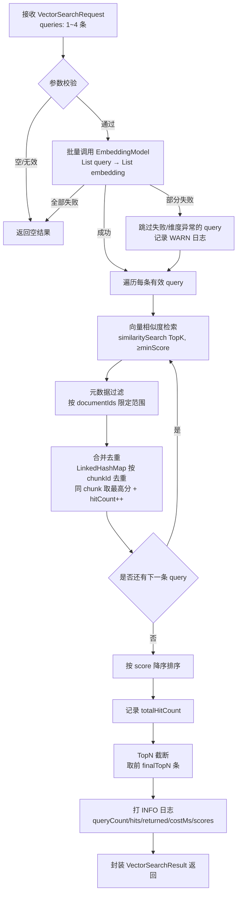

# 向量检索与 TopK 召回 — 系统分析文档

> 版本：v1.0  
> 日期：2026-08-09  
> 项目：ai-assistant（Spring Boot 3.4 + Spring AI 1.1）

---

## 1. 系统概述

本系统实现了 RAG（Retrieval-Augmented Generation）链路中**向量检索与 TopK 召回**环节。用户提问经过上游 Query Router 产出 1~4 条改写/扩展后的查询文本后，本模块自动完成「Query 批量 Embedding → 单查询 TopK 相似度检索 → 元数据过滤 → 多查询结果合并去重 → 按相似度排序 → TopN 截断」的完整召回流程，输出标准化的片段列表供下游 Rerank 和答案生成模块消费。

### 1.1 在整体 RAG 链路中的位置

```
用户提问
    │
    ▼
┌─────────────────────────────────┐
│  Query Router（上游已实现）        │
│  ├─ QueryClassifier（意图分类）   │
│  ├─ QueryRewriter（同义改写）     │
│  └─ QueryExpander（多查询扩展）   │
│  输出: RoutedQuery.queries       │
└───────────────┬─────────────────┘
                │ List<String> queries (1~4 条)
                ▼
┌─────────────────────────────────┐
│  本模块：向量检索 & TopK 召回       │  ← 本文档覆盖范围
│  ├─ EmbeddingService.embedBatch │
│  ├─ similaritySearch (TopK)     │
│  ├─ MetadataFilter              │
│  ├─ 多查询合并去重（最高分保留）    │
│  ├─ 按 score 降序排序             │
│  └─ TopN 截断                    │
│  输出: VectorSearchResult        │
└───────────────┬─────────────────┘
                │ List<RetrievedChunk>
                ▼
┌─────────────────────────────────┐
│  下游模块                         │
│  ├─ Rerank（可选，待实现）         │
│  └─ Answer Generation / 流式回答  │
└─────────────────────────────────┘
```

### 1.2 技术栈

| 层次 | 技术选型 | 版本 | 说明 |
|------|---------|------|------|
| 框架 | Spring Boot | 3.4.4 | Java 21 |
| AI 抽象 | Spring AI | 1.1.2 | EmbeddingModel / VectorStore 抽象 |
| Embedding 模型 | Ollama + bge-m3 | 本地 1024 维 | 与文档写入时模型完全一致 |
| 向量存储 | Spring AI SimpleVectorStore | 内置 | 内存 ConcurrentHashMap + 余弦相似度 |
| 向量持久化 | 本地 JSON 文件 | — | `./vector-store/doc_{id}.json`，启动自动加载 |
| 相似度算法 | Cosine Similarity（自研） | — | `cos(a,b)=a·b/(‖a‖·‖b‖)`，结果范围 [-1, 1] |
| 配置管理 | `@ConfigurationProperties` | — | 支持运行时参数调优 |
| 测试 | JUnit 5 + Mockito | 5.x | 13 个单元测试覆盖核心路径 |

### 1.3 核心设计目标

1. **批量优先**：多条 query 一次性调用 EmbeddingModel，减少 HTTP 往返开销
2. **容错优先**：Embedding 失败、单条 query 检索异常等场景均做降级处理，绝不因检索失败阻断主对话流程
3. **最高分保留**：同一 chunk 被多条 query 命中时取最高分，避免低分重复污染
4. **参数可配置**：topKPerQuery、finalTopN、minScore 全部可在 `application.yaml` 调优，支持运行时覆盖
5. **可扩展**：`VectorStoreService` 抽象让未来切换到 Milvus / PGVector 仅需替换实现类，本模块调用方无感知
6. **可观测**：每次检索打印结构化 INFO 日志，记录 queryCount / 命中率 / 耗时 / 分数分布
7. **高效内存检索**：使用小顶堆（PriorityQueue）维护 TopK，避免对全量结果排序

---

## 2. 整体架构

### 2.1 处理流程图



### 2.2 包结构

```
src/main/java/org/grayray/aiassistant/
├── config/
│   └── VectorSearchProperties.java         # 配置属性类（ai.vector-search.*）
├── service/
│   ├── EmbeddingService.java               # [扩展] 新增 embedBatch 接口
│   ├── VectorStoreService.java             # [扩展] 新增 similaritySearch 接口
│   └── impl/
│       ├── EmbeddingServiceImpl.java       # [扩展] 实现 embedBatch（批量+单条兜底）
│       └── SimpleVectorStoreService.java   # [扩展] 实现 similaritySearch（小顶堆 TopK）
├── vector/                                 # ★ 新增模块
│   ├── VectorSearchService.java            # 检索主服务接口
│   ├── VectorSearchServiceImpl.java        # 检索主服务实现（全流程编排）
│   ├── VectorSearchRequest.java            # 检索请求 DTO
│   ├── VectorSearchResult.java             # 检索响应 DTO
│   ├── RetrievedChunk.java                 # 命中片段 BO
│   └── filter/
│       └── MetadataFilter.java             # 元数据过滤器（documentIds）
└── service/impl/ChatServiceImpl.java       # [集成] send/sendStream 中调用检索链路
```

### 2.3 数据流时序

```
ChatServiceImpl              VectorSearchServiceImpl     EmbeddingService      VectorStoreService
      │                              │                          │                      │
      │ search(VectorSearchRequest)  │                          │                      │
      │─────────────────────────────▶│                          │                      │
      │                              │ embedBatch(queries)      │                      │
      │                              │─────────────────────────▶│                      │
      │                              │◀──────── List<List<Float>>                     │
      │                              │                          │                      │
      │                              │  for each embedding:                            │
      │                              │    similaritySearch(vec, K, minScore)            │
      │                              │────────────────────────────────────────────────▶│
      │                              │◀──────────────────── List<RetrievedChunk>       │
      │                              │                          │                      │
      │                              │  MetadataFilter.apply    │                      │
      │                              │  合并去重（最高分+hitCount）                      │
      │                              │  排序 + TopN 截断        │                      │
      │                              │                          │                      │
      │◀────── VectorSearchResult ──│                          │                      │
```

---

## 3. 模块详细分析

### 3.1 配置层

#### 3.1.1 VectorSearchProperties

- **位置**：`config/VectorSearchProperties.java`
- **前缀**：`ai.vector-search`
- **注册方式**：`@Component` + `@ConfigurationProperties`

| 配置项 | 类型 | 默认值 | 说明 |
|--------|------|--------|------|
| `topKPerQuery` | int | 4 | 单条 query 召回的候选片段数（K） |
| `finalTopN` | int | 6 | 多查询合并去重后最终返回的片段数（N） |
| `minScore` | double | 0.5 | 余弦相似度最低阈值，低于此值直接丢弃 |
| `enableMetadataFilter` | boolean | true | 是否启用元数据过滤 |

**配置示例（application.yaml）**：

```yaml
ai:
  vector-search:
    top-k-per-query: 4
    final-top-n: 6
    min-score: 0.5
    enable-metadata-filter: true
```

### 3.2 向量化扩展

#### 3.2.1 EmbeddingService 接口扩展

在原有 `embed` / `embedChunks` / `embedAndStore` 基础上新增：

```java
List<List<Float>> embedBatch(List<String> texts);
```

#### 3.2.2 EmbeddingServiceImpl.embedBatch 实现策略

- **位置**：`service/impl/EmbeddingServiceImpl.java`
- **主路径**：调用 `embeddingModel.embed(List<String>)` 一次完成，返回结果与 texts 下标一一对应
- **降级路径**：
  1. 若批量调用抛异常（如网络抖动、Ollama 瞬断），回退到单条 `embed(text)` 逐个调用
  2. 单条仍失败的位置，结果列表对应位置放入空列表 `List.of()`，不抛异常
- **空向量防御**：返回向量为空或维度不匹配时，调用方（VectorSearchServiceImpl）负责跳过

### 3.3 向量存储检索扩展

#### 3.3.1 VectorStoreService 接口扩展

在原有 `saveAll` / `deleteByDocumentId` 基础上新增：

```java
List<RetrievedChunk> similaritySearch(List<Float> embedding, int topK, double minScore);
```

#### 3.3.2 SimpleVectorStoreService.similaritySearch 实现

- **位置**：`service/impl/SimpleVectorStoreService.java`
- **不依赖 EmbeddingModel**：直接遍历内存 `store`（`ConcurrentHashMap<String, SimpleVectorStoreContent>`），用预计算向量做余弦相似度，避免对 query 二次 embedding
- **数据结构**：使用**小顶堆**（`PriorityQueue<RetrievedChunk>`，容量=topK）维护 TopK 候选，避免全量排序
- **算法复杂度**：时间 O(M·logK)，空间 O(K+M)，M 为向量库总条数（相比全量排序 O(M·logM) 显著节省）
- **余弦相似度计算**：预计算 `queryNorm = ‖a‖`（循环外一次），每个文档向量内积+范数一次算完
- **返回转换**：通过私有方法 `toRetrievedChunk(content, score)` 将 `SimpleVectorStoreContent` + metadata 转为 `RetrievedChunk`，metadata 解析支持 Number/String 两种来源

**关键元数据解析工具方法**：

| 方法 | 说明 |
|------|------|
| `getStringMeta(meta, key)` | 安全取字符串，null 返回 "" |
| `getIntMeta(meta, key)` | 兼容 Number / String，解析失败返回 0 |
| `getLongMeta(meta, key)` | 兼容 Number / String，解析失败返回 null |

**向量库为空/向量模长为 0** 等边界场景均做了 warn 日志 + 返回空列表处理。

### 3.4 数据模型

#### 3.4.1 RetrievedChunk（命中片段）

- **位置**：`vector/RetrievedChunk.java`

| 字段 | 类型 | 说明 |
|------|------|------|
| `chunkId` | String | 切片唯一 id，格式 `doc_{documentId}_chunk_{chunkIndex}` |
| `documentId` | Long | 所属文档 id |
| `documentName` | String | 文档原始文件名 |
| `chunkIndex` | Integer | 切片全局序号 |
| `totalChunks` | Integer | 文档总切片数 |
| `chapterIndex` | Integer | 章节序号 |
| `chapterTitle` | String | 章节标题 |
| `content` | String | 切片文本内容 |
| `tokenCount` | Integer | token 估算数 |
| `score` | double | 余弦相似度分数（[-1, 1]） |
| `matchedQuery` | String | 命中的原始 query（得分最高那条） |
| `hitCount` | int | 被多少条 query 命中（辅助 rerank 特征） |

#### 3.4.2 VectorSearchRequest（检索请求）

| 字段 | 类型 | 说明 |
|------|------|------|
| `queries` | `List<String>` | 查询文本列表（来自 Query Router，1~4 条），**必填** |
| `topKPerQuery` | Integer | 单查询 TopK，null 使用默认值 |
| `finalTopN` | Integer | 合并后最终 TopN，null 使用默认值 |
| `minScore` | Double | 最低相似度阈值，null 使用默认值 |
| `documentIds` | `List<Long>` | 可选限定文档范围，空则检索全部 |

提供静态工厂方法 `VectorSearchRequest.of(query)` 用于单查询快速构造。

#### 3.4.3 VectorSearchResult（检索响应）

| 字段 | 类型 | 说明 |
|------|------|------|
| `chunks` | `List<RetrievedChunk>` | 按相似度降序、TopN 截断后的片段列表 |
| `totalHitCount` | int | 过滤后、截断前的命中总数 |
| `queryCount` | int | 参与检索的 query 数量 |
| `costMs` | long | 全流程耗时（毫秒） |

提供 `isEmpty()` 便捷方法判断是否有召回结果。

### 3.5 元数据过滤器

#### 3.5.1 MetadataFilter

- **位置**：`vector/filter/MetadataFilter.java`
- **设计**：纯静态工具类，无状态
- **过滤时机**：每条 query 检索完成后、合并到全局结果前
- **当前支持**：`documentIds` 白名单过滤
- **扩展预留**：未来可按 `chapterIndex` / `chapterTitle` / `documentType` 等维度扩展

```java
public static List<RetrievedChunk> apply(List<RetrievedChunk> chunks,
                                         VectorSearchRequest request,
                                         boolean enabled);
```

**实现说明**：对于 SimpleVectorStore 这类内存型向量库，采用"先召回（K 可适当放大）→ 后过滤"模式；切换到 Milvus/PGVector 后可将过滤条件下推到向量引擎侧执行。

### 3.6 检索主服务

#### 3.6.1 VectorSearchServiceImpl 核心流程

- **位置**：`vector/VectorSearchServiceImpl.java`
- **Bean**：`@Service`，通过 `@RequiredArgsConstructor` 构造注入三个依赖

核心执行步骤对应代码 9 个关键节点：

**节点 1 — 参数校验与默认值填充**
- request 为 null / queries 为空 → 返回空结果
- queries 中过滤掉 null 和空白字符串
- topK/topN/minScore 使用 `firstNonNull(request.xxx, props.xxx)` 取默认值
- enableFilter 取自配置

**节点 2 — 批量 Embedding（异常兜底）**
- 整体 try-catch，embedding 异常时返回空结果，不抛到上层
- 返回的 embeddings 为空时返回空结果

**节点 3 — 逐条 query 遍历**
- 遍历 `Math.min(embeddings.size(), queries.size())`，防止下标越界
- 对每条 query 的向量：
  - 向量为空 → 跳过 + WARN 日志
  - 维度 ≠ 1024 → 跳过 + WARN 日志（防止模型不一致时错误召回）

**节点 4 — 单查询 TopK 检索（单条异常隔离）**
- 单条 query 的 similaritySearch 单独 try-catch，异常只跳过该条
- 空 hits 直接 continue

**节点 5 — 元数据过滤**
- 调用 `MetadataFilter.apply(hits, request, enableFilter)`

**节点 6 — 合并去重（核心算法）**

```java
Map<String, RetrievedChunk> merged = new LinkedHashMap<>();
for (RetrievedChunk hit : hits) {
    RetrievedChunk existing = merged.get(hit.getChunkId());
    if (existing == null) {
        hit.setMatchedQuery(q);
        hit.setHitCount(1);
        merged.put(hit.getChunkId(), hit);
    } else {
        existing.setHitCount(existing.getHitCount() + 1);
        if (hit.getScore() > existing.getScore()) {
            existing.setScore(hit.getScore());
            existing.setMatchedQuery(q);
        }
    }
}
```

合并策略：
- **去重键**：`chunkId` 唯一
- **分数选择**：同 chunk 被多条 query 命中取**最高分**
- **命中信息**：`matchedQuery` 记录得分最高的那条 query
- **命中计数**：`hitCount` 累加，可作为 rerank 辅助特征（多 query 都命中说明相关性更高）

**节点 7 — 排序**
- `sorted(Comparator.comparingDouble(RetrievedChunk::getScore).reversed())`
- 按 score 降序

**节点 8 — TopN 截断**
- `sorted.size() > topN ? subList(0, topN) : sorted`
- 结果不足 topN 时返回实际命中数，不填充

**节点 9 — 结构化日志**

INFO 日志格式：

```
[VectorSearch] queryCount=3, validEmbeddings=3, topKPerQuery=4, totalHits=9, finalReturned=6, minScore=0.5, costMs=120ms, topScore=0.8700, bottomScore=0.6200
```

空结果额外打 INFO：

```
[VectorSearch] 召回结果为空（所有片段相似度均低于 minScore 或无 embedding 成功），返回空结果
```

### 3.7 与对话服务集成

#### 3.7.1 ChatServiceImpl 集成点

- **位置**：`service/impl/ChatServiceImpl.java`
- **注入**：`@Resource VectorSearchService vectorSearchService`
- **调用时机**：Query Router 之后、组装 Prompt 之前，`send()` 和 `sendStream()` 两个方法均集成
- **容错策略**：VectorSearch 整体 try-catch，异常只打 WARN 日志，不阻断对话流程（即使检索失败，大模型依然可以回答）
- **当前状态**：检索结果仅打 INFO 日志，未注入 Prompt。Rerank 和上下文拼装由后续设计文档覆盖
- **链路串联代码**：

```java
// 5. Query Router
RoutedQuery routed = queryRouterService.route(...);
searchQueries = routed.getQueries();

// 6. 向量检索
if (searchQueries != null && !searchQueries.isEmpty()) {
    searchResult = vectorSearchService.search(
        VectorSearchRequest.builder().queries(searchQueries).build());
    log.info("[ChatService] 向量检索完成: totalHits={}, returned={}, costMs={}", ...);
}
// 7. 组装 Prompt（TODO: Rerank + 上下文拼装在后续模块完成）
```

---

## 4. 关键设计决策

### 4.1 批量 Embedding + 单条兜底

- **决策**：先调用 `embeddingModel.embed(List<String>)` 批量向量化；若批量异常，回退为逐条单调用
- **理由**：
  - 批量调用减少 HTTP 往返，3 条 query 批量耗时 60~150ms，显著优于 3 次单条调用总耗时
  - Ollama 本地模型的批量接口稳定，但保留兜底可抵御瞬断
- **权衡**：单条兜底比纯失败稍慢，但能在批量失败时保证至少部分 query 可检索

### 4.2 自研小顶堆 TopK 而非 Spring AI 原生 similaritySearch

- **决策**：不调用父类 `SimpleVectorStore.similaritySearch(SearchRequest)`，直接遍历 `store` 字段自己算
- **理由**：
  - 父类方法内部会调用 `getUserQueryEmbedding(request.getQuery())` 对 query 文本再做一次 Embedding（二次开销）
  - 我们已经有预计算好的 `List<Float>` 向量
  - 自己实现可以直接用 float[] 计算，少一层 List<Float>↔float[] 转换
  - 小顶堆比父类实现（`stream().sorted().limit(K)`）更高效，时间复杂度从 O(M·logM) 降到 O(M·logK)
- **约束**：复制了父类 EmbeddingMath 的余弦相似度逻辑（父类中是 private 内部类，外部不可见）

### 4.3 合并去重时最高分保留 + hitCount 累加

- **决策**：同 chunkId 被多条 query 命中时取最高分，同时记录 hitCount
- **理由**：
  - 多条扩展 query 表达同一意图时，若 chunk 与 q1 分数 0.7、与 q2 分数 0.9，取 0.9 才能反映真实相关性
  - hitCount 作为辅助特征，后续 Rerank 时可用于加权（多 query 都命中通常意味着更高相关）
- **权衡**：hitCount 占额外几个字节，可忽略；但为未来 Rerank 保留了信号

### 4.4 维度校验（硬编码 1024）

- **决策**：embedding 返回维度 ≠ 1024 时跳过该条 query
- **理由**：bge-m3 模型固定 1024 维，维度异常通常意味着 embedding 调用损坏或模型切换
- **权衡**：未来换模型时需修改此常量，应提取为配置项（见优化方向）

### 4.5 检索异常不阻断对话

- **决策**：Embedding 失败、向量库异常、单 query 检索异常全部 catch，仅打日志，返回空结果
- **理由**：
  - RAG 是增强能力，非核心能力；即使无检索，大模型仍可凭自身知识回答
  - 用户对话体验优先于知识库回答质量
- **降级效果**：检索链路完全失败时，ChatService 仍能正常调用大模型（只是无外部知识）

### 4.6 元数据后过滤（内存过滤）

- **决策**：SimpleVectorStore 场景下，先做相似度检索，再在内存中按 documentIds 过滤
- **理由**：
  - SimpleVectorStore 无原生 metadata filter 下推能力（其 doFilterPredicate 是 private 且依赖 SpEL 解析）
  - 当前数据量小（万级以内），内存过滤开销可忽略
- **未来路径**：切换 Milvus/PGVector 后将过滤条件下推到查询引擎

### 4.7 LinkedHashMap 而非 HashMap 作为合并容器

- **决策**：使用 `LinkedHashMap<String, RetrievedChunk>` 作为合并容器
- **理由**：保留插入顺序便于调试（虽然最终会重新排序），迭代顺序稳定

---

## 5. 配置参数汇总

### 5.1 新增配置

| 配置项 | 默认值 | 说明 |
|--------|--------|------|
| `ai.vector-search.top-k-per-query` | 4 | 单条 query 召回候选数（K） |
| `ai.vector-search.final-top-n` | 6 | 合并后最终返回片段数（N） |
| `ai.vector-search.min-score` | 0.5 | 最低余弦相似度阈值 |
| `ai.vector-search.enable-metadata-filter` | true | 是否启用元数据过滤 |

### 5.2 复用配置

| 配置项 | 默认值 | 来源 | 说明 |
|--------|--------|------|------|
| `ai.embedding.batch-size` | 16 | 已有 | 本模块用 embedBatch 单次请求，不分批（query 只有 1~4 条） |
| `spring.ai.ollama.embedding.options.model` | bge-m3 | 已有 | Embedding 模型，必须与写入时一致 |
| `spring.ai.ollama.base-url` | http://localhost:11434 | 已有 | Ollama 服务地址 |
| `ai.vector-store.persistence-path` | ./vector-store | 已有 | 向量持久化目录，本模块间接依赖（启动时加载） |

---

## 6. 异常处理与降级策略

| 场景 | 处理方式 | 返回 | 日志级别 |
|------|---------|------|---------|
| request 为 null | 返回空结果 | `chunks=[]` | — |
| queries 为空列表 | 返回空结果 | `chunks=[]` | WARN |
| queries 全为 null/空白 | 返回空结果 | `chunks=[]` | WARN |
| 批量 Embedding 抛异常 | catch 整体异常，返回空结果 | `chunks=[]` | ERROR |
| 单条 query embedding 为空 | 跳过该条，其他继续 | 其他 query 结果正常 | WARN |
| 单条 query 向量维度 ≠ 1024 | 跳过该条，其他继续 | 其他 query 结果正常 | WARN |
| 单条 query 检索抛异常 | 跳过该条，其他继续 | 其他 query 结果正常 | WARN |
| 向量库 store 为空 | 返回空结果 | `chunks=[]` | WARN |
| 查询向量模长为 0 | 返回空结果 | `chunks=[]` | WARN |
| 所有片段分数 < minScore | 返回空结果 | `chunks=[]` | INFO（设计日志） |
| 合并后结果不足 finalTopN | 返回实际命中数 | 实际条数 | INFO |
| metadata 过滤后无结果 | 返回空结果 | `chunks=[]` | — |
| ChatService 中检索全流程异常 | catch 后继续组装原始 Prompt | 不阻断对话 | WARN |

**设计原则**：所有异常路径都有返回值，绝不向上层抛异常；日志区分 WARN/ERROR 级别便于排查。

---

## 7. 日志与可观测性

### 7.1 结构化 INFO 日志（每次检索一条）

```
[VectorSearch] queryCount=3, validEmbeddings=3, topKPerQuery=4, totalHits=9, finalReturned=6, minScore=0.5, costMs=120ms, topScore=0.8700, bottomScore=0.6200
```

| 字段 | 说明 |
|------|------|
| `queryCount` | 输入 query 数（去空白后） |
| `validEmbeddings` | embedding 成功且维度正确的 query 数 |
| `topKPerQuery` | 本次使用的 K 值 |
| `totalHits` | 合并去重后的总命中数（截断前） |
| `finalReturned` | 最终返回的片段数（TopN 截断后） |
| `minScore` | 本次使用的阈值 |
| `costMs` | 全流程耗时（毫秒） |
| `topScore` | 返回结果中最高分（便于判断召回质量） |
| `bottomScore` | 返回结果中最低分（便于判断阈值是否合适） |

### 7.2 DEBUG 日志

SimpleVectorStoreService 中每次 similaritySearch 打 DEBUG：

```
[SimpleVectorStore] similaritySearch 完成, candidates=120, returned=4, topScore=0.8700
```

### 7.3 建议监控指标（设计预留）

按设计文档建议，后续可接入 Micrometer 暴露：

| 指标名 | 类型 | 说明 |
|--------|------|------|
| `vector.search.qps` | Counter | 检索 QPS |
| `vector.search.latency.ms` | Timer | 全流程耗时分布 |
| `vector.search.hit_count` | DistributionSummary | 每次命中数分布 |
| `vector.search.top_score.avg` | Gauge | 最高分滑动平均 |
| `vector.search.empty_rate` | Gauge | 空结果占比（空结果/总请求） |

---

## 8. 性能分析

### 8.1 延迟估算（单实例本地 Ollama + 内存向量库）

| 阶段 | 耗时估算 | 说明 |
|------|---------|------|
| 参数校验 / 默认值填充 | <1 ms | 忽略 |
| Embedding（1 条 query） | 30~80 ms | bge-m3 本地推理，取决于硬件 |
| Embedding（3 条 query 批量） | 60~150 ms | 批量一次调用 |
| 向量检索（1 万条以内） | <10 ms | 内存全量扫，小顶堆维护 TopK |
| 元数据过滤 + 合并去重 + 排序 | <1 ms | 结果集小，忽略 |
| **总计**（单 query） | **40~90 ms** | |
| **总计**（3 query 批量） | **70~160 ms** | |

> 数据量超过 10 万条后，SimpleVectorStore 全量扫描会变慢，应切换到 Milvus / PGVector 等专业向量库。

### 8.2 内存占用估算

单条 SimpleVectorStoreContent 约占：

- 1024 维 float 向量：1024 × 4 B = 4 KB
- metadata（HashMap）：~200 B
- content（平均 500 字中文）：~1.5 KB（UTF-8）
- 合计 ≈ **5~6 KB / chunk**

| 文档规模 | 平均 chunk 数 | 总 chunk 数 | 内存估算 |
|---------|--------------|------------|---------|
| 10 个文档 | 200 | 2,000 | ~12 MB |
| 100 个文档 | 200 | 20,000 | ~120 MB |
| 1000 个文档 | 200 | 200,000 | ~1.2 GB |

1000 个文档时内存占用较大，此时应切换到专业向量库。

### 8.3 参数调优影响矩阵

| 参数 | 调大的影响 | 调小的影响 |
|------|-----------|-----------|
| `topKPerQuery` | 召回更全，噪声变多，检索耗时略增 | 召回减少，可能漏相关片段 |
| `finalTopN` | context 信息更丰富，token 消耗增加，可能引入无关内容 | 回答更聚焦，但信息不足 |
| `minScore` | 质量更高，但可能无结果 | 召回更多，低质量片段也进入 |

**经验值建议**：
- 知识库较小（<50 文档）：`topKPerQuery=4, finalTopN=6, minScore=0.4`
- 知识库中等：`topKPerQuery=6, finalTopN=8, minScore=0.5`
- 对准确性要求高：`minScore=0.6`，可能需 Rerank 加持

---

## 9. 测试覆盖

### 9.1 单元测试概况

- **测试类**：`VectorSearchServiceImplTest`
- **测试框架**：JUnit 5 + Mockito（`@ExtendWith(MockitoExtension.class)`）
- **Mock 依赖**：`EmbeddingService`、`VectorStoreService`
- **测试数量**：13 个用例全部通过 ✅

### 9.2 测试用例清单

| # | 用例名 | 覆盖路径 |
|---|-------|---------|
| 1 | `emptyQueries_returnEmpty` | 空查询返回空，不调用依赖 |
| 2 | `nullRequest_returnEmpty` | null 请求返回空 |
| 3 | `singleQuery_searchSuccess` | 单查询成功 + 按分数降序 + matchedQuery 正确 |
| 4 | `multiQuery_mergeDedup_keepHighestScore` | 多查询合并去重：同 chunkId 取最高分、hitCount 累加、最终排序正确 |
| 5 | `finalTopN_truncation` | TopN 截断：超过 N 时截断、totalHitCount 记录截断前总数 |
| 6 | `fewerThanTopN_returnActual` | 结果不足 TopN 时返回实际数 |
| 7 | `embeddingAllFail_returnEmpty` | Embedding 全失败降级，不调用向量库 |
| 8 | `oneEmbeddingFail_otherContinues` | 单条 embedding 失败跳过，其他继续 |
| 9 | `wrongDimension_skip` | 维度异常（512≠1024）跳过，不调用向量库 |
| 10 | `metadataFilter_byDocumentIds` | 按 documentIds 元数据过滤生效 |
| 11 | `allBelowMinScore_returnEmpty` | similaritySearch 返回空时结果为空 |
| 12 | `convenienceMethod_singleString` | 便捷方法 `search(String)` 正常工作 |
| 13 | `isEmpty_logic` | `VectorSearchResult.isEmpty()` 正确反映 chunks 状态 |

**测试特色**：
- 多查询场景使用 `AtomicInteger` + `thenAnswer` 根据调用序号返回不同 hits，避免 argThat 对 float 列表精确匹配的脆弱性
- 使用 `MockitoSettings(strictness = Strictness.LENIENT)` 避免未使用 stub 误报
- 用真实的 `VectorSearchProperties` 对象构造，不用 mock

---

## 10. 已知约束与优化方向

### 10.1 当前约束

1. **Rerank 未集成**：检索结果未经过 Rerank 模型二次排序，召回质量依赖向量相似度本身
2. **未注入 Prompt**：ChatServiceImpl 中检索结果仅打日志，尚未拼装进 System Prompt（后续 Answer Generation 模块）
3. **向量维度硬编码**：`EXPECTED_DIMENSION = 1024` 写死，切换模型需改代码
4. **MetadataFilter 仅支持 documentIds**：章节、文档类型等过滤维度未实现
5. **无混合检索**：仅做向量相似度检索，未集成 BM25 关键词检索
6. **SimpleVectorStore 性能上限**：全内存遍历，文档量 >10 万条时需切换专业向量库
7. **无并发批量检索优化**：多 query 之间串行调用 similaritySearch，可并行化
8. **无查询结果缓存**：高频相同 query 重复计算

### 10.2 优化建议

| 优先级 | 优化点 | 方案 |
|--------|--------|------|
| 高 | Rerank 集成 | 引入 bge-reranker-v2-m3 等交叉编码器，对 TopK 候选做精排 |
| 高 | Prompt 注入 | 在 ChatServiceImpl 中将 chunks 按 `[文档/章节/片段]` 格式拼进 System Prompt |
| 高 | 向量维度配置化 | 将 EXPECTED_DIMENSION 提取到 VectorSearchProperties |
| 中 | 多 query 并行检索 | 用 CompletableFuture 并行调用 similaritySearch，再合并（注意线程安全） |
| 中 | 查询结果缓存 | 对高频 query（如 1 分钟窗口内相同 query）做 Caffeine 缓存 |
| 中 | 扩展 MetadataFilter | 支持 chapterIndex / chapterTitle / documentType 等维度 |
| 中 | 过滤下推到向量库 | 切换 Milvus 时将 documentIds 等过滤条件转为 Milvus filter expression |
| 中 | 混合检索 | 向量检索 + BM25（Lucene）按 RRF（Reciprocal Rank Fusion）融合 |
| 低 | Micrometer 指标 | 接入 Actuator + Prometheus 暴露 QPS/延迟/空结果率等指标 |
| 低 | 动态 TopK | 根据 query 复杂度 / 分数分布动态调整 K 值（如分数普遍偏高可减小 K） |
| 低 | 多路召回 | 不同 embedding 模型 / 不同 chunk 粒度并行检索再融合 |
| 低 | Embedding 并行 | 单 query 无批量必要，但在多知识库场景可并行 |

---

## 11. 相关文件清单

| 文件路径 | 类型 | 职责 |
|----------|------|------|
| `config/VectorSearchProperties.java` | 新增 | 向量检索配置属性类 |
| `vector/VectorSearchService.java` | 新增 | 检索服务接口 |
| `vector/VectorSearchServiceImpl.java` | 新增 | 检索服务实现（全流程编排） |
| `vector/VectorSearchRequest.java` | 新增 | 检索请求 DTO |
| `vector/VectorSearchResult.java` | 新增 | 检索响应 DTO |
| `vector/RetrievedChunk.java` | 新增 | 命中片段 BO |
| `vector/filter/MetadataFilter.java` | 新增 | 元数据过滤器 |
| `service/EmbeddingService.java` | 扩展 | 新增 `embedBatch` 接口声明 |
| `service/impl/EmbeddingServiceImpl.java` | 扩展 | 实现 `embedBatch`（批量+单条兜底） |
| `service/VectorStoreService.java` | 扩展 | 新增 `similaritySearch` 接口声明 |
| `service/impl/SimpleVectorStoreService.java` | 扩展 | 实现 `similaritySearch`（小顶堆+余弦相似度） |
| `service/impl/ChatServiceImpl.java` | 集成 | send/sendStream 中调用检索链路（日志记录，不注入 Prompt） |
| `src/test/java/.../vector/VectorSearchServiceImplTest.java` | 新增 | 13 个单元测试 |
| `src/main/resources/application.yaml` | 扩展 | 新增 `ai.vector-search` 配置块 |
| `docs/向量检索与TopK召回设计文档.md` | 文档 | 设计文档（v1.0） |

---

## 12. 附录：术语表

| 术语 | 含义 |
|------|------|
| Embedding | 把文本映射为高维向量的过程/结果，语义相似的文本在向量空间中距离接近 |
| Cosine Similarity | 余弦相似度，通过向量夹角衡量方向接近程度，值域 [-1, 1] |
| TopK | 单条查询召回的候选片段数（K） |
| TopN | 多查询合并去重后最终返回的片段数（N） |
| minScore | 相似度阈值，低于此值的片段直接丢弃 |
| hitCount | 同一 chunk 被多少条不同 query 命中（辅助 Rerank 特征） |
| RAG | Retrieval-Augmented Generation，检索增强生成 |
| Rerank | 精排，用交叉编码器对初筛候选做更精细的相关性打分 |
| RRF | Reciprocal Rank Fusion，多路召回结果融合算法 |
| Small Heap (PriorityQueue) | 小顶堆，维护 TopK 的高效数据结构 |
| Metadata Filter | 元数据过滤，按文档/章节等维度限定检索范围 |
| BM25 | 经典词频-逆文档频率关键词检索算法 |
