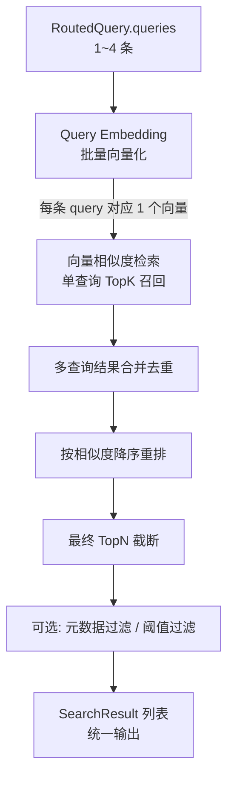

# 向量检索与 TopK 召回设计文档

> 版本：v1.0
> 日期：2026-08-08
> 项目：ai-assistant（Spring Boot 3.4 + Spring AI 1.1）
> 范围：本文档仅定义 Query Embedding → 向量检索 → TopK 召回链路；Query 路由（前置）、Rerank / 答案生成（后置）由对应设计文档覆盖。

---

## 1. 概述

### 1.1 目标

针对经过 Query Router 处理后的查询（`List<String> queries`），完成**向量化 → 向量相似度检索 → TopK 召回 → 合并去重 → 元数据拼装**全流程，输出标准化的检索结果列表，供下游生成模型消费。

### 1.2 在整体链路中的位置

```
上游：Query Router（产出 RoutedQuery.queries）
        ↓
  本模块：向量检索 & TopK 召回
        ↓
下游：Rerank（可选） / Answer Generation / 流式回答
```

### 1.3 技术栈

| 层次 | 技术 | 说明 |
|------|------|------|
| Embedding 模型 | Ollama + bge-m3 | 本地 1024 维，与写入时保持一致 |
| Embedding 抽象 | Spring AI `EmbeddingModel` | 复用 `EmbeddingService` |
| 向量存储 | Spring AI `SimpleVectorStore`（当前） | 内存 + 本地 JSON 持久化，余弦相似度 |
| 向量存储抽象 | `VectorStoreService` 接口 | 未来可无缝切到 Milvus / PGVector |
| 相似度度量 | Cosine Similarity | 取值范围 [-1, 1]，越接近 1 越相似 |

---

## 2. 整体流程



---

## 3. Query Embedding

### 3.1 设计要点

- **模型一致性**：检索时使用的 Embedding 模型与文档写入时完全相同（Ollama bge-m3，1024 维），保证向量空间一致。
- **批量优先**：`queries` 有 N 条时调用一次批量 embedding 接口，减少 HTTP 开销。
- **复用现有能力**：通过 `EmbeddingService.embed(text)` / `embedChunks(...)` 的扩展，或直接调用 Spring AI `EmbeddingModel.embed(List<String>)`。

### 3.2 扩展接口（建议在 EmbeddingService 中新增）

```java
/**
 * 批量对文本列表生成 embedding
 *
 * @param texts 文本列表
 * @return 与 texts 下标一一对应的 embedding 列表
 */
List<List<Float>> embedBatch(List<String> texts);
```

### 3.3 错误处理

| 场景 | 策略 |
|------|------|
| 某条 query embedding 失败 | 跳过该条，记录 WARN；其余 query 继续检索 |
| 全部 query embedding 失败 | 返回空结果列表，由下游按"无检索结果"兜底 |
| 向量维度异常（≠1024） | 跳过该条，记录 WARN |

---

## 4. 向量相似度检索

### 4.1 相似度计算

- **算法**：余弦相似度（Cosine Similarity）
- **公式**：`cos(a, b) = (a·b) / (||a|| * ||b||)`
- **取值范围**：`[-1, 1]`
- **排序方向**：分数越高越相似，结果按 `score` **降序**返回

### 4.2 单查询 TopK

每条 query 向量独立做一次相似度检索，召回 `K` 个候选片段。

**参数：**

| 参数 | 默认值 | 说明 |
|------|--------|------|
| `topKPerQuery` | `4` | 单条 query 召回的候选片段数 |
| `minScore` | `0.5` | 最低相似度阈值，低于此值的结果直接丢弃 |

> 注：`topKPerQuery` 与 `minScore` 做成可配置项，支持运行时调整。

### 4.3 VectorStoreService 检索接口扩展

当前 `VectorStoreService` 只有写入/删除接口，需要新增检索接口：

```java
public interface VectorStoreService {

    // ... 已有 saveAll / deleteByDocumentId ...

    /**
     * 相似度检索（单向量）
     *
     * @param embedding 查询向量
     * @param topK      召回数量
     * @param minScore  最低相似度阈值（含）
     * @return 命中的片段列表，按相似度降序
     */
    List<RetrievedChunk> similaritySearch(List<Float> embedding, int topK, double minScore);
}
```

### 4.4 RetrievedChunk 结果结构

```java
@Data
@Builder
public class RetrievedChunk {
    private String chunkId;             // 切片唯一 id（doc_{id}_chunk_{index}）
    private Long documentId;            // 所属文档 id
    private String documentName;        // 文档名
    private Integer chunkIndex;         // 切片序号
    private Integer totalChunks;        // 文档总切片数
    private Integer chapterIndex;       // 章节序号
    private String chapterTitle;        // 章节标题
    private String content;             // 切片文本内容
    private Integer tokenCount;         // token 估算数
    private double score;               // 相似度分数（余弦）
    private String matchedQuery;        // 命中的原始 query（多查询场景下便于调试）
}
```

### 4.5 SimpleVectorStore 实现思路

继承自 Spring AI 的 `SimpleVectorStore`，已有内置的 `similaritySearch` 能力。需要做一层适配：

1. 把 `List<Float>` 转成 `float[]`
2. 调用 `SimpleVectorStore.similaritySearch(SearchRequest.query(...).withTopK(K))`
3. 把返回的 `Document`（Spring AI）+ `_distance` 元数据转换为 `RetrievedChunk`
4. 注意 Spring AI 内部可能用的是 `distance`（1 - cosine），需要转换为 `score = 1 - distance`

---

## 5. 多查询结果合并去重

当 `queries` 数量 > 1 时（即 complex 类型的 Query Expansion 场景），多条召回结果需要合并。

### 5.1 合并策略

| 策略 | 说明 | 采用 |
|------|------|------|
| 去重键 | `chunkId` 唯一 | ✅ |
| 分数选择 | 同一 chunk 被多条 query 命时，**取最高分** | ✅ |
| 命中信息 | 记录 `matchedQuery` 为得分最高的那条 query | ✅ |
| 额外标记 | 可选 `hitCount` 字段标记被多少条 query 命中，作为下游 rerank 的辅助特征 | ⭕ 可选 |

### 5.2 合并后排序与截断

- **排序**：按 `score` 降序
- **最终 TopN**：合并去重后取前 `N` 条作为最终召回结果

**参数：**

| 参数 | 默认值 | 说明 |
|------|--------|------|
| `finalTopN` | `6` | 合并去重后最终返回的最大片段数 |

> 经验值：单 query TopK=4，若有 3 条 query，合并去重后一般剩 8~10 条，取 Top 6 既能保证召回覆盖面也不会让 context 过长。

---

## 6. 过滤能力（可选增强）

### 6.1 元数据过滤

支持通过 metadata 字段限定检索范围，常见场景：

| 过滤维度 | 字段 | 场景 |
|----------|------|------|
| 指定文档 | `documentId IN [...]` | 用户选择了特定文档后问答 |
| 指定章节 | `chapterIndex = ?` / `chapterTitle = ?` | 按章节聚焦 |
| 文档类型 | `documentType`（预留） | 限定 PDF / 知识库等类型 |

### 6.2 实现方式

- **SimpleVectorStore**：内存全量过滤 —— 先相似度召回扩大 K（如 K*2），再在结果上做 metadata 过滤，最后截断到 TopN。
- **Milvus / PGVector**（未来切换后）：原生支持 metadata filter，下推到向量引擎侧执行。

### 6.3 检索请求对象

```java
@Data
@Builder
public class VectorSearchRequest {
    private List<String> queries;       // 查询文本列表（来自 Query Router）
    private Integer topKPerQuery;       // 单查询 TopK，null 用默认
    private Integer finalTopN;          // 合并后 TopN，null 用默认
    private Double minScore;            // 最低相似度，null 用默认
    private List<Long> documentIds;     // 可选：限定文档范围
    // ... 后续可扩展更多过滤条件
}
```

---

## 7. 统一输出结构

### 7.1 VectorSearchResult

```java
@Data
@Builder
public class VectorSearchResult {
    private List<RetrievedChunk> chunks;    // 召回的片段列表（按相似度降序）
    private int totalHitCount;              // 命中总条数（过滤后、截断前）
    private int queryCount;                 // 参与检索的 query 数量
    private long costMs;                    // 检索总耗时（含 embedding + 检索 + 合并）
}
```

### 7.2 下游消费格式约定

下游生成模块从 `chunks` 中取 `content` 组装 Prompt 时，建议格式：

```
[文档: xxx.pdf / 章节: 第一章 / 片段 1]
内容内容内容...

[文档: yyy.pdf / 章节: 第二章 / 片段 2]
内容内容内容...
```

具体拼装方式由回答生成模块的设计文档定义。

---

## 8. 模块代码结构设计

### 8.1 包结构

```
com.grayray.aiassistant.
└── vector/
    ├── VectorSearchService.java          // 检索主服务（对外入口）
    ├── RetrievedChunk.java               // 检索结果片段
    ├── VectorSearchRequest.java          // 检索请求
    ├── VectorSearchResult.java           // 检索响应
    └── filter/                           // （可选）过滤策略
        └── MetadataFilter.java
```

> 注：`EmbeddingService`、`VectorStoreService` 已存在于现有 `service` 包中，本模块直接复用。

### 8.2 核心接口

```java
public interface VectorSearchService {

    /**
     * 向量检索入口（支持多查询）
     *
     * @param request 检索请求
     * @return 检索结果（已合并去重、按相似度降序、TopN 截断）
     */
    VectorSearchResult search(VectorSearchRequest request);

    /**
     * 便捷方法：单查询检索
     */
    default VectorSearchResult search(String query) {
        return search(VectorSearchRequest.builder()
                .queries(List.of(query))
                .build());
    }
}
```

### 8.3 主流程伪代码

```java
public VectorSearchResult search(VectorSearchRequest request) {
    long start = System.currentTimeMillis();
    List<String> queries = request.getQueries();

    // 1. 批量 embedding
    List<List<Float>> embeddings = embeddingService.embedBatch(queries);

    // 2. 单查询 TopK 检索
    int topK = firstNonNull(request.getTopKPerQuery(), defaultTopKPerQuery);
    double minScore = firstNonNull(request.getMinScore(), defaultMinScore);
    Map<String, RetrievedChunk> merged = new LinkedHashMap<>();

    for (int i = 0; i < embeddings.size(); i++) {
        List<Float> vec = embeddings.get(i);
        String q = queries.get(i);
        List<RetrievedChunk> hits = vectorStoreService.similaritySearch(vec, topK, minScore);

        // 应用元数据过滤（如有 documentIds 等）
        hits = applyFilter(hits, request);

        // 合并去重（同 chunkId 取最高分）
        for (RetrievedChunk hit : hits) {
            RetrievedChunk existing = merged.get(hit.getChunkId());
            if (existing == null || hit.getScore() > existing.getScore()) {
                hit.setMatchedQuery(q);
                merged.put(hit.getChunkId(), hit);
            }
        }
    }

    // 3. 按 score 降序排序
    List<RetrievedChunk> sorted = merged.values().stream()
            .sorted(Comparator.comparingDouble(RetrievedChunk::getScore).reversed())
            .toList();

    int totalHitCount = sorted.size();

    // 4. TopN 截断
    int topN = firstNonNull(request.getFinalTopN(), defaultFinalTopN);
    List<RetrievedChunk> resultList = sorted.size() > topN
            ? sorted.subList(0, topN) : sorted;

    return VectorSearchResult.builder()
            .chunks(resultList)
            .totalHitCount(totalHitCount)
            .queryCount(queries.size())
            .costMs(System.currentTimeMillis() - start)
            .build();
}
```

---

## 9. 配置项

所有调优参数做成可配置，通过 `application.yaml` 注入：

```yaml
ai:
  vector-search:
    top-k-per-query: 4         # 单查询 TopK
    final-top-n: 6             # 合并后最终 TopN
    min-score: 0.5             # 最低相似度阈值
    enable-metadata-filter: true
```

```java
@Data
@ConfigurationProperties(prefix = "ai.vector-search")
public class VectorSearchProperties {
    private int topKPerQuery = 4;
    private int finalTopN = 6;
    private double minScore = 0.5;
    private boolean enableMetadataFilter = true;
}
```

---

## 10. 日志与可观测性

每次检索打一条 INFO 日志：

```
[VectorSearch] queryCount=3, topKPerQuery=4, totalHits=9, finalReturned=6,
 minScore=0.5, costMs=120, topScore=0.87, bottomScore=0.62
```

核心指标：

| 指标 | 说明 |
|------|------|
| `vector.search.qps` | 检索 QPS |
| `vector.search.latency.ms` | 检索总耗时（embedding + search + merge） |
| `vector.search.hit_count` | 每次检索命中数（截断前） |
| `vector.search.top_score.avg` | 最高相似度平均分 |
| `vector.search.empty_rate` | 空结果占比 |

---

## 11. 异常与降级策略

| 场景 | 策略 |
|------|------|
| Embedding 调用超时/失败 | 返回空结果集（`chunks=[]`），下游按无检索结果处理 |
| 向量存储不可用（空或加载失败） | 返回空结果集，记录 ERROR |
| 单条 query 检索异常 | 跳过该条，其他 query 继续，记录 WARN |
| 合并后结果不足 `finalTopN` | 返回实际命中数，不做填充 |
| 相似度全低于 `minScore` | 返回空结果集 |

---

## 12. 性能评估与调优建议

### 12.1 延迟估算（单实例本地 Ollama + 内存向量库）

| 阶段 | 耗时估算 | 说明 |
|------|----------|------|
| Embedding（1 条 query） | 30~80 ms | bge-m3 本地推理，取决于硬件 |
| Embedding（3 条 query 批量） | 60~150 ms | 批量一次调用 |
| 向量检索（1 万条以内） | < 10 ms | 内存全量扫，很快 |
| 合并去重 + 排序 | < 1 ms | 忽略 |
| **总计** | **100~250 ms** | 单 query 更快 |

> 数据量上来后（>10 万条），SimpleVectorStore 的全量扫描会变慢，应切换到 Milvus / PGVector 等专业向量库。

### 12.2 效果调优维度

| 维度 | 调大的影响 | 调小的影响 |
|------|-----------|-----------|
| `topKPerQuery` | 召回更全，但噪声变多、耗时增加 | 召回减少、可能漏相关片段 |
| `finalTopN` | context 信息更丰富，但 token 消耗增加、可能引入无关内容 | 回答更聚焦，但信息不足 |
| `minScore` | 质量更高，但可能无结果 | 召回更多，但低质量片段也进入 |

建议通过**离线评估集**（标准问题 + 标准答案 + 人工标注相关文档），用 Recall@K / MRR 等指标找到最优参数组合。

---

## 13. 未来扩展方向

- **混合检索（Hybrid Search）**：向量检索 + 关键词检索（BM25）结合，互补召回
- **多路召回**：不同 embedding 模型 / 不同 chunk 粒度并行检索再融合
- **查询改写增强**：对 query 做同义词扩展、翻译后再检索
- **动态 TopK**：根据 query 复杂度、结果分数分布动态调整 K 值

---

## 14. 附录：术语表

| 术语 | 含义 |
|------|------|
| Embedding | 把文本转为高维向量的过程/结果 |
| Cosine Similarity | 余弦相似度，衡量两个向量方向的接近程度 |
| TopK | 每条查询召回的候选片段数 |
| TopN | 多查询合并后最终返回的片段数 |
| Recall@K | TopK 结果中相关文档占全部相关文档的比例 |
| MRR | Mean Reciprocal Rank，第一个相关文档排名倒数的平均值 |
| 混合检索 | 向量检索 + 关键词检索结合的召回方式 |
