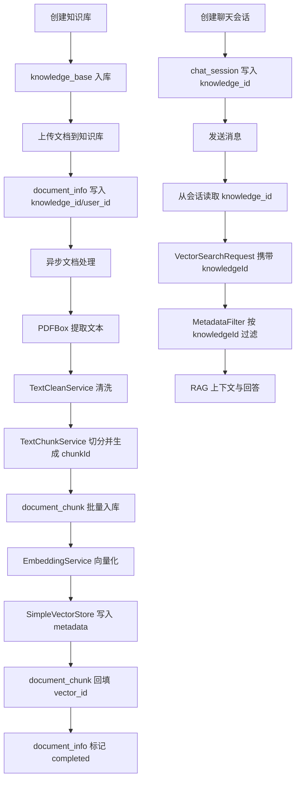

# 知识库功能 — 系统分析文档

> 版本：v1.0  
> 日期：2026-08-18  
> 项目：ai-assistant（Spring Boot 3.4 + Spring AI 1.1）  
> 范围：知识库 CRUD → 知识库文档上传 → Chunk 入库 → 向量 Metadata 隔离 → 会话绑定知识库 → RAG 检索过滤

---

## 1. 系统概述

知识库功能为现有 RAG 系统增加了**多知识库隔离管理能力**。用户可以创建多个知识库，将文档上传到指定知识库；文档解析切分后，系统会同时持久化 Chunk 元数据到 MySQL，并将 `knowledgeId` 写入向量库 metadata。聊天会话可以绑定知识库，后续检索会基于会话绑定的 `knowledgeId` 做范围过滤，避免跨知识库召回。

### 1.1 系统定位

本功能位于文档管理、向量存储和聊天问答之间，是 RAG 链路中的**知识隔离与元数据治理层**。

```
用户
 │
 ▼
知识库管理
 │
 ├── 创建 / 查询 / 更新 / 删除知识库
 │
 ├── 上传文档到知识库
 │       │
 │       ▼
 │   文档解析 / 切分 / Chunk 入库 / 向量化
 │
 └── 创建绑定知识库的聊天会话
         │
         ▼
      RAG 检索按 knowledgeId 过滤
```

### 1.2 解决的核心问题

| 问题 | 解决方案 |
|------|----------|
| 多个项目或任务文档混在同一向量库中 | 引入 `knowledge_base` 表和 `knowledge_id` 元数据 |
| 文档切片只存在向量库，缺少业务侧可追踪记录 | 新增 `document_chunk` 表，持久化 chunk 文本、业务 ID、章节、token、向量 ID |
| 检索可能跨文档或跨业务范围召回 | `VectorSearchRequest.knowledgeId` + `MetadataFilter` 后过滤 |
| 会话不知道应该基于哪个知识库回答 | `chat_session.knowledge_id` 绑定知识库 |
| 已有数据库升级后实体新增字段导致 SQL 报错 | 增加启动时轻量 schema migrator 幂等补齐表、列、索引 |

### 1.3 技术栈

| 层次 | 技术 | 版本 / 说明 |
|------|------|-------------|
| 语言 | Java | 21 |
| 框架 | Spring Boot | 3.4.4 |
| ORM | MyBatis-Plus | 3.5.7，`IService` / `ServiceImpl` 模式 |
| 数据库 | MySQL | 8.x |
| AI 抽象 | Spring AI | 1.1.2 |
| 向量存储 | SimpleVectorStore | 当前默认实现，内存 + JSON 持久化 |
| 文档解析 | Apache PDFBox | 当前处理 PDF |
| Token 估算 | jtokkit | CL100K_BASE |

---

## 2. 整体架构

### 2.1 模块位置

当前项目已经拆分为多 Maven 模块。知识库功能先落在 `ai-assistant-document` 模块中，避免新增独立模块带来额外依赖调整。

```
ai-assistant-document
├── controller
│   ├── DocumentController              # 旧文档上传接口，保留兼容
│   └── KnowledgeBaseController         # 知识库管理与知识库文档上传
├── dto
│   ├── KnowledgeBaseCreateDTO
│   ├── KnowledgeBaseUpdateDTO
│   └── KnowledgeBaseDeleteDTO
├── entity
│   ├── KnowledgeBase
│   ├── DocumentChunk
│   └── DocumentInfo                    # 新增 knowledgeId 字段
├── mapper
│   ├── KnowledgeBaseMapper
│   ├── DocumentChunkMapper
│   └── DocumentInfoMapper
├── service
│   ├── KnowledgeBaseService
│   ├── DocumentChunkService
│   ├── DocumentUploadService           # 新增 upload(file, userId, knowledgeId)
│   └── TextChunkService                # 新增 chunk(cleanedText, knowledgeId, ...)
└── service.impl
    ├── KnowledgeBaseServiceImpl
    ├── DocumentChunkServiceImpl
    ├── DocumentUploadServiceImpl
    ├── DocumentProcessServiceImpl
    └── TextChunkServiceImpl
```

### 2.2 总体链路



### 2.3 核心数据关系

```
sys_user
  │
  ├── 1:N ── knowledge_base
  │              │
  │              └── 1:N ── document_info
  │                              │
  │                              └── 1:N ── document_chunk
  │                                               │
  │                                               └── VectorStore metadata
  │                                                    - chunkId
  │                                                    - knowledgeId
  │                                                    - documentId
  │
  └── 1:N ── chat_session
                  │
                  └── knowledge_id 绑定 knowledge_base
```

---

## 3. 功能模块分析

### 3.1 知识库管理模块

#### 3.1.1 Controller

- **类**：`KnowledgeBaseController`
- **职责**：提供知识库 CRUD、知识库内文档列表、知识库文档上传、文档 Chunk 查询接口。

| 接口 | 方法 | 说明 |
|------|------|------|
| `/knowledge/create` | POST | 创建知识库 |
| `/knowledge/list?userId=...` | GET | 查询用户知识库列表 |
| `/knowledge/{knowledgeId}?userId=...` | GET | 查询知识库详情 |
| `/knowledge/{knowledgeId}/update` | POST | 更新名称、描述、状态 |
| `/knowledge/{knowledgeId}/delete` | POST | 删除知识库 |
| `/knowledge/{knowledgeId}/document/upload?userId=...` | POST | 上传文档到指定知识库 |
| `/knowledge/{knowledgeId}/documents?userId=...` | GET | 查询知识库文档列表 |
| `/knowledge/document/{documentId}/chunks?userId=...` | GET | 查询文档 Chunk 列表 |

#### 3.1.2 Service

- **接口**：`KnowledgeBaseService`
- **实现**：`KnowledgeBaseServiceImpl`

核心方法：

| 方法 | 职责 |
|------|------|
| `create(userId, name, description)` | 创建知识库，初始化向量库类型、路径、collection |
| `listByUserId(userId)` | 查询用户自己的知识库 |
| `getUserKnowledgeBase(userId, knowledgeId)` | 查询并校验归属 |
| `requireActiveUserKnowledgeBase(userId, knowledgeId)` | 查询并校验状态为 `ACTIVE` |
| `updateInfo(...)` | 更新名称、描述、状态 |
| `deleteByUser(userId, knowledgeId)` | 逻辑删除知识库、文档、Chunk，并删除文档向量 |

#### 3.1.3 关键业务规则

1. `userId` 必填，所有知识库操作都带用户归属校验。
2. 知识库名称会 `trim`，同一用户下 `ACTIVE/INACTIVE` 状态的知识库不允许重名。
3. 新建知识库默认：
   - `vectorStoreType = SIMPLE`
   - `status = ACTIVE`
   - `vectorStorePath = {ai.vector-store.persistence-path}/kb_{knowledgeId}`
   - `vectorCollection = kb_{knowledgeId}`
4. 更新状态当前只允许 `ACTIVE/INACTIVE`。
5. 删除知识库时采用逻辑删除，并按文档 ID 删除 SimpleVectorStore 中的向量。

### 3.2 文档上传改造

#### 3.2.1 旧接口兼容

旧接口 `POST /document/upload` 保留，仍调用：

```java
DocumentUploadResult upload(MultipartFile file)
```

该入口不绑定知识库，适合历史文档、临时上传或一次性问答场景。

#### 3.2.2 知识库上传入口

知识库上传入口调用：

```java
DocumentUploadResult upload(MultipartFile file, Long userId, Long knowledgeId)
```

写入 `document_info` 时新增：

| 字段 | 值 |
|------|----|
| `knowledge_id` | URL 路径中的 `knowledgeId` |
| `user_id` | 请求参数中的 `userId` |
| `process_status` | `pending` |

上传前由 `KnowledgeBaseService.requireActiveUserKnowledgeBase` 校验：

1. 知识库存在
2. 知识库属于当前用户
3. 知识库状态为 `ACTIVE`

### 3.3 文档处理与 Chunk 入库

#### 3.3.1 异步处理流程

`DocumentProcessServiceImpl.processDocument(documentId)` 在原有 PDF 处理链路基础上新增了 Chunk 持久化：

```
document_info(pending)
    │
    ▼
processing
    │
    ├── PDFBox 提取文本
    ├── TextCleanService 清洗
    ├── TextChunkService 切分，注入 knowledgeId/chunkId/chunkVersion
    ├── DocumentChunkService.saveTextChunks() 批量写 document_chunk
    ├── EmbeddingService.embedAndStore() 写向量库
    ├── DocumentChunkService.markVectorIds() 回填 vector_id
    │
    ▼
completed / failed
```

#### 3.3.2 TextChunk 扩展字段

`TextChunk` 增加：

| 字段 | 说明 |
|------|------|
| `chunkId` | 稳定业务 ID，当前格式 `doc_{documentId}_v1_chunk_{chunkIndex}` |
| `knowledgeId` | 所属知识库 ID |
| `chunkVersion` | 切分版本，当前默认 1 |
| `pageNumber` | PDF 页码预留字段 |

#### 3.3.3 DocumentChunkService

`DocumentChunkServiceImpl.saveTextChunks` 将每个 `TextChunk` 转成 `DocumentChunk` 实体。

写入字段包括：

| 字段 | 来源 |
|------|------|
| `chunk_id` | `TextChunk.chunkId` |
| `document_id` | `documentInfo.id` |
| `knowledge_id` | `documentInfo.knowledgeId` |
| `chunk_version` | `TextChunk.chunkVersion` |
| `chunk_index` | `TextChunk.chunkIndex` |
| `total_chunks` | `TextChunk.totalChunks` |
| `content` | `TextChunk.content` |
| `content_hash` | `SHA-256(content)` |
| `chapter_index` | `TextChunk.chapterIndex` |
| `chapter_title` | `TextChunk.chapterTitle` |
| `token_count` | `TextChunk.tokenCount` |
| `metadata_json` | chunkId、knowledgeId、documentId、章节、token 等扩展元数据 |

向量写入成功后，`markVectorIds` 会将 `vector_id` 回填为 `chunkId`，使数据库记录和向量库业务 ID 对齐。

### 3.4 向量写入与检索隔离

#### 3.4.1 SimpleVectorStoreService Metadata

写入向量时，`SimpleVectorStoreService.saveAll` 会优先使用 `TextChunk.chunkId` 作为向量 ID。若为空，则按默认规则生成。

metadata 关键字段：

| 字段 | 说明 |
|------|------|
| `chunkId` | 向量业务 ID |
| `knowledgeId` | 知识库 ID，检索隔离核心字段 |
| `documentId` | 文档 ID |
| `chunkVersion` | 切分版本 |
| `chunkIndex` | Chunk 序号 |
| `totalChunks` | 当前文档 Chunk 总数 |
| `pageNumber` | 页码预留 |
| `chapterIndex` | 章节序号 |
| `chapterTitle` | 章节标题 |
| `documentName` | 原始文档名 |
| `tokenCount` | Token 估算数 |

#### 3.4.2 检索请求扩展

`VectorSearchRequest` 增加：

```java
private Long knowledgeId;
```

聊天链路中，`ChatServiceImpl` 不直接相信前端传入知识库 ID，而是从 `chat_session.knowledge_id` 读取绑定值：

```java
VectorSearchRequest.builder()
    .queries(searchQueries)
    .knowledgeId(session.getKnowledgeId())
    .build()
```

#### 3.4.3 MetadataFilter

`MetadataFilter` 从只支持 `documentIds` 过滤，扩展为支持：

1. `knowledgeId`
2. `documentIds`

过滤规则：

```text
若 knowledgeId 不为空：只保留 RetrievedChunk.knowledgeId == request.knowledgeId
若 documentIds 不为空：只保留 documentId 在白名单中的 Chunk
两者同时存在时取交集
```

这种实现适合当前 SimpleVectorStore 场景：先做 TopK 召回，再在内存中按 metadata 后过滤。未来切换到 Milvus/PGVector 后，可将 `knowledgeId/documentIds` 下推到向量数据库查询条件中。

### 3.5 聊天会话绑定知识库

#### 3.5.1 chat_session 扩展

`ChatSession` 增加：

```java
private Long knowledgeId;
```

`ChatSessionCreateDTO` 与 `ChatSessionVO` 同步增加 `knowledgeId`。

#### 3.5.2 创建会话

`ChatSessionService` 保留旧方法：

```java
ChatSession create(Long userId, String title, String sessionType);
```

并新增重载：

```java
ChatSession create(Long userId, String title, String sessionType, Long knowledgeId);
```

当 `knowledgeId` 为空时，保持普通聊天会话；当 `knowledgeId` 不为空时，后续消息检索会限定该知识库。

#### 3.5.3 当前约束

当前会话创建接口仅保存 `knowledgeId`，尚未在 chat 模块校验知识库是否属于该用户。这是因为知识库服务目前在 `ai-assistant-document` 模块，而 `ai-assistant-chat` 未依赖 document 模块，避免产生模块反向依赖。

当前可靠入口是：

1. 先通过 `/knowledge/{knowledgeId}` 或知识库上传接口校验归属
2. 再创建携带 `knowledgeId` 的会话

后续可通过新增 `ai-assistant-knowledge-api` 模块或领域查询接口解决跨模块校验问题。

---

## 4. 数据库设计分析

### 4.1 knowledge_base

知识库主表，记录用户创建的知识库及向量存储配置。

| 字段 | 说明 |
|------|------|
| `id` | 知识库主键 |
| `user_id` | 创建用户 ID |
| `name` | 知识库名称 |
| `description` | 知识库描述 |
| `vector_store_type` | 向量库类型，当前为 `SIMPLE` |
| `vector_store_path` | 向量库持久化路径 |
| `vector_collection` | 向量库 collection/table 名称 |
| `status` | `ACTIVE/INACTIVE/REBUILDING` |
| `create_time/update_time` | 创建/更新时间 |
| `is_deleted` | 逻辑删除标识 |

主要索引：

| 索引 | 用途 |
|------|------|
| `idx_user_id` | 用户维度查询 |
| `idx_user_status` | 查询用户可用知识库 |
| `idx_status` | 后台按状态扫描 |
| `idx_vector_store_type` | 后续多向量库类型过滤 |

### 4.2 document_info 扩展

新增：

| 字段 | 说明 |
|------|------|
| `knowledge_id` | 文档所属知识库，允许为空以兼容历史文档 |

新增索引：

| 索引 | 用途 |
|------|------|
| `idx_knowledge_id` | 查询某知识库下文档 |
| `idx_user_knowledge` | 查询某用户某知识库下文档 |
| `idx_process_status` | 后台扫描待处理/失败文档 |

### 4.3 document_chunk

文档 Chunk 表，补齐向量库之外的业务元数据和文本追踪能力。

| 字段 | 说明 |
|------|------|
| `chunk_id` | 稳定业务 ID，与向量库 ID / metadata 对齐 |
| `document_id` | 所属文档 |
| `knowledge_id` | 所属知识库 |
| `chunk_version` | 切分版本 |
| `chunk_index` | 当前版本内顺序 |
| `total_chunks` | 当前文档总 Chunk 数 |
| `content` | Chunk 文本 |
| `content_hash` | 文本 SHA-256 |
| `page_number` | PDF 页码预留 |
| `chapter_index/chapter_title` | 章节信息 |
| `token_count` | Token 估算 |
| `vector_id` | 向量库 ID，当前等于 `chunk_id` |
| `metadata_json` | 扩展元数据 |

唯一约束：

| 约束 | 说明 |
|------|------|
| `uk_chunk_id` | 保证业务 Chunk ID 全局唯一 |
| `uk_doc_version_chunk` | 保证同一文档同一版本内 chunk 顺序唯一 |

### 4.4 chat_session 扩展

新增：

| 字段 | 说明 |
|------|------|
| `knowledge_id` | 会话绑定的知识库 ID，普通会话可为空 |

新增索引：

| 索引 | 用途 |
|------|------|
| `idx_knowledge_id` | 查询某知识库相关会话 |
| `idx_user_knowledge` | 查询某用户某知识库下会话 |

### 4.5 Schema 迁移策略

项目当前没有 Flyway/Liquibase，因此新增了轻量启动迁移器：

- **类**：`KnowledgeSchemaMigrator`
- **模块**：`ai-assistant-server`
- **开关**：`ai.schema-migration.enabled=true`，默认开启

启动时检查并补齐：

1. `knowledge_base` 表
2. `document_chunk` 表
3. `document_info.knowledge_id`
4. `chat_session.knowledge_id`
5. 相关索引

迁移器使用 `DatabaseMetaData` 判断表、列、索引是否存在，避免重复执行 DDL。

同时保留独立 SQL：

```
ai-assistant-server/src/main/resources/db/v3_knowledge_base_migration.sql
```

该 SQL 可用于手动迁移或后续纳入正式迁移工具。

---

## 5. 异常处理与权限边界

### 5.1 业务异常

| 场景 | 处理 |
|------|------|
| `userId` 为空 | 抛 `BAD_REQUEST` |
| `knowledgeId` 为空 | 抛 `BAD_REQUEST` |
| 知识库不存在或不属于用户 | 抛 `NOT_FOUND` |
| 知识库非 ACTIVE | 抛 `BAD_REQUEST` |
| 同一用户下知识库重名 | 抛 `BAD_REQUEST` |
| 上传文件为空 | 抛 `BusinessException` |
| 文档不存在或无权限 | 返回 `NOT_FOUND` |

### 5.2 文档处理失败

异步处理阶段保持原有失败策略：

| 失败阶段 | 结果 |
|----------|------|
| 文档记录不存在 | 记录 warn，直接返回 |
| 非 PDF 文件 | 直接标记 `completed` |
| 本地文件不存在 | 标记 `failed` |
| PDF 解析/清洗/切分/入库/向量化异常 | 标记 `failed`，写入 `process_error` |

当前 Chunk 入库发生在向量化之前。如果向量化失败，会保留已入库 Chunk，供后续重试或排查。

### 5.3 删除策略

删除知识库时：

1. 校验知识库归属
2. 查询当前用户该知识库下所有文档
3. 按文档 ID 调用 `vectorStoreService.deleteByDocumentId`
4. 逻辑删除 `document_chunk`
5. 逻辑删除 `document_info`
6. 逻辑删除 `knowledge_base`

该策略优先保证业务数据不可见；向量删除当前同步执行，后续可改为异步补偿任务。

---

## 6. 数据一致性分析

### 6.1 ID 对齐

知识库功能中有三个关键 ID：

| ID | 所在位置 | 作用 |
|----|----------|------|
| `knowledgeId` | DB、TextChunk、VectorSearchRequest、VectorStore metadata | 知识库隔离 |
| `documentId` | `document_info`、`document_chunk`、VectorStore metadata | 文档归属与删除 |
| `chunkId` | `document_chunk.chunk_id`、VectorStore id、VectorStore metadata | Chunk 稳定业务主键 |

当前实现保证：

```
document_chunk.chunk_id == SimpleVectorStoreContent.id == metadata.chunkId
document_chunk.vector_id == document_chunk.chunk_id
```

### 6.2 处理状态一致性

```
pending
  │
  ▼
processing
  │
  ├── Chunk 入库成功 + 向量写入成功 + vector_id 回填成功
  │       ▼
  │   completed
  │
  └── 任一异常
          ▼
      failed + process_error
```

### 6.3 当前一致性风险

| 风险 | 原因 | 影响 | 后续建议 |
|------|------|------|----------|
| Chunk 入库成功但向量化失败 | Chunk 入库在向量化前 | DB 有 chunk，无向量 | 增加重试接口或后台任务 |
| 向量写入成功但回填失败 | 回填逐条更新 | vector_id 为空 | 按 chunkId 修复 |
| 知识库删除中途失败 | 向量删除、DB 逻辑删除非同一事务资源 | DB 与向量库可能不一致 | 异步清理 + 补偿日志 |
| 旧向量文件无 knowledgeId | 历史向量 metadata 缺字段 | 绑定知识库检索不会命中旧向量 | 提供历史数据归库和重建脚本 |

---

## 7. 配置与可观测性

### 7.1 相关配置

| 配置项 | 默认值 | 说明 |
|--------|--------|------|
| `ai.vector-store.persistence-path` | `./vector-store` | SimpleVectorStore 持久化根目录 |
| `ai.vector-search.enable-metadata-filter` | `true` | 是否启用 metadata 后过滤 |
| `ai.schema-migration.enabled` | `true` | 是否启用轻量 schema 自动补齐 |

### 7.2 日志关注点

| 模块 | 日志 |
|------|------|
| `KnowledgeSchemaMigrator` | 启动时记录创建表、添加列、添加索引 |
| `DocumentUploadServiceImpl` | 文件上传完成并触发异步处理 |
| `DocumentProcessServiceImpl` | 文档处理开始、完成、失败 |
| `SimpleVectorStoreService` | 向量写入、删除、启动加载 |
| `VectorSearchServiceImpl` | 检索命中数、耗时、分数区间 |

### 7.3 建议监控指标

| 指标 | 说明 |
|------|------|
| `knowledge.count.active` | 活跃知识库数量 |
| `knowledge.document.count` | 知识库文档数量 |
| `knowledge.chunk.count` | 知识库 Chunk 数量 |
| `document.process.failed.count` | 文档处理失败数 |
| `rag.search.knowledge.empty_rate` | 指定知识库检索空结果率 |
| `vector.delete.failed.count` | 向量删除失败数 |

---

## 8. 当前约束与后续优化

### 8.1 当前约束

1. 知识库功能暂放在 `ai-assistant-document` 模块，没有独立 `ai-assistant-knowledge` 模块。
2. 会话创建时保存 `knowledgeId`，但 chat 模块暂未直接依赖知识库服务做归属校验。
3. 文档解析当前仍主要支持 PDF，非 PDF 文件直接标记完成。
4. `chunkVersion` 当前固定为 1，尚未实现同一文档重新切分版本升级。
5. SimpleVectorStore 当前仍按全局持久化目录管理，`vectorStorePath` 已写入知识库表，但尚未实现按知识库分目录加载。
6. 删除知识库时向量删除同步执行，缺少失败补偿队列。
7. 启动迁移器适合当前开发阶段，生产环境建议切换到 Flyway/Liquibase。

### 8.2 优化方向

| 优先级 | 优化点 | 方案 |
|--------|--------|------|
| 高 | 会话绑定知识库权限校验 | 抽出 `ai-assistant-knowledge-api`，供 chat 模块校验 |
| 高 | 文档处理重试 | 按 `process_status=failed` 提供重试接口，生成新 `chunkVersion` |
| 高 | 历史数据归库 | 为旧文档创建默认知识库并重建向量 metadata |
| 中 | 按知识库分目录持久化 | SimpleVectorStore 按 `kb_{knowledgeId}` 目录保存和加载 |
| 中 | 文档删除接口 | 删除单文档时同步逻辑删除 chunk 并删除向量 |
| 中 | Chunk 查询分页 | 大文档 Chunk 数量多时避免一次性返回全部 |
| 中 | 多格式解析 | 接入 Tika / POI 支持 Word、TXT 等 |
| 低 | 统计接口 | 返回知识库文档数、Chunk 数、处理状态分布 |
| 低 | 正式迁移工具 | 引入 Flyway/Liquibase 管理版本化 DDL |

---

## 9. 关键文件清单

### 9.1 新增文件

| 文件 | 职责 |
|------|------|
| `ai-assistant-document/src/main/java/org/grayray/aiassistant/document/entity/KnowledgeBase.java` | 知识库实体 |
| `ai-assistant-document/src/main/java/org/grayray/aiassistant/document/entity/DocumentChunk.java` | 文档 Chunk 实体 |
| `ai-assistant-document/src/main/java/org/grayray/aiassistant/document/mapper/KnowledgeBaseMapper.java` | 知识库 Mapper |
| `ai-assistant-document/src/main/java/org/grayray/aiassistant/document/mapper/DocumentChunkMapper.java` | Chunk Mapper |
| `ai-assistant-document/src/main/java/org/grayray/aiassistant/document/service/KnowledgeBaseService.java` | 知识库服务接口 |
| `ai-assistant-document/src/main/java/org/grayray/aiassistant/document/service/DocumentChunkService.java` | Chunk 服务接口 |
| `ai-assistant-document/src/main/java/org/grayray/aiassistant/document/service/impl/KnowledgeBaseServiceImpl.java` | 知识库服务实现 |
| `ai-assistant-document/src/main/java/org/grayray/aiassistant/document/service/impl/DocumentChunkServiceImpl.java` | Chunk 服务实现 |
| `ai-assistant-document/src/main/java/org/grayray/aiassistant/document/controller/KnowledgeBaseController.java` | 知识库接口 |
| `ai-assistant-document/src/main/java/org/grayray/aiassistant/document/dto/KnowledgeBaseCreateDTO.java` | 创建请求 |
| `ai-assistant-document/src/main/java/org/grayray/aiassistant/document/dto/KnowledgeBaseUpdateDTO.java` | 更新请求 |
| `ai-assistant-document/src/main/java/org/grayray/aiassistant/document/dto/KnowledgeBaseDeleteDTO.java` | 删除请求 |
| `ai-assistant-document/src/main/java/org/grayray/aiassistant/document/vo/KnowledgeBaseVO.java` | 知识库响应对象 |
| `ai-assistant-server/src/main/java/org/grayray/aiassistant/config/KnowledgeSchemaMigrator.java` | 启动时 schema 幂等补齐 |
| `ai-assistant-server/src/main/resources/db/v3_knowledge_base_migration.sql` | 知识库手动迁移 SQL |

### 9.2 修改文件

| 文件 | 修改内容 |
|------|----------|
| `DocumentInfo.java` | 增加 `knowledgeId` |
| `DocumentUploadService.java` | 增加知识库上传方法 |
| `DocumentUploadServiceImpl.java` | 上传时写入 `userId/knowledgeId` |
| `TextChunkService.java` | 增加带 `knowledgeId` 的切分方法 |
| `TextChunkServiceImpl.java` | 生成 `chunkId/knowledgeId/chunkVersion` |
| `DocumentProcessServiceImpl.java` | 增加 Chunk 入库与 vectorId 回填 |
| `TextChunk.java` | 增加 `chunkId/knowledgeId/chunkVersion/pageNumber` |
| `SimpleVectorStoreService.java` | metadata 增加 `knowledgeId/chunkVersion/pageNumber` |
| `EmbeddingServiceImpl.java` | Spring AI Document metadata 增加知识库字段 |
| `VectorSearchRequest.java` | 增加 `knowledgeId` |
| `RetrievedChunk.java` | 增加 `knowledgeId` |
| `MetadataFilter.java` | 支持 `knowledgeId + documentIds` 过滤 |
| `RerankedChunk.java` / `RerankResult.java` | 重排过程中保留 `knowledgeId` |
| `ChatSession.java` | 增加 `knowledgeId` |
| `ChatSessionCreateDTO.java` | 创建会话支持传 `knowledgeId` |
| `ChatSessionVO.java` | 会话响应返回 `knowledgeId` |
| `ChatSessionService.java` / `ChatSessionServiceImpl.java` | 创建会话重载支持知识库绑定 |
| `ChatController.java` | 创建会话与 VO 转换透传 `knowledgeId` |
| `ChatServiceImpl.java` | 检索请求从会话读取 `knowledgeId` |
| `schema.sql` | 增加知识库表、Chunk 表、相关字段和索引 |

---

## 10. 总结

知识库功能当前已经形成后端基础闭环：

1. 用户可以创建、查询、更新、删除知识库。
2. 文档可以上传到指定知识库，并在 `document_info` 中记录归属。
3. 文档处理后会持久化 `document_chunk`，同时写入向量库。
4. `knowledgeId` 已贯穿 TextChunk、向量 metadata、检索请求、检索结果和 rerank 结果。
5. 聊天会话可以绑定知识库，发送消息时按会话绑定的知识库检索。
6. 旧数据库可通过启动迁移器或 `v3_knowledge_base_migration.sql` 补齐 schema。

该功能为后续“按项目/任务隔离问答”“知识库级文档管理”“向量库重建”“Milvus/PGVector 切换”奠定了元数据和接口基础。
