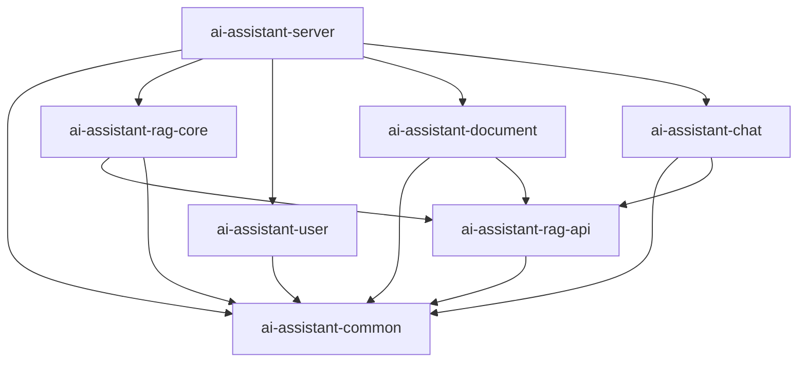

# 项目多模块拆分设计计划

> 版本：v1.1
> 日期：2026-08-17
> 项目：ai-assistant
> 范围：本文档定义将当前单 Maven 后端模块拆分为多模块项目的推荐方案、依赖方向、迁移步骤、风险控制与验收标准。前端 `ai-assistant-frontend` 已是独立 Vite 项目，本次不纳入 Maven 子模块。

---

## 1. 拆分结论

结合当前代码规模、依赖关系和后续 RAG 能力演进，最合适的拆分方式是：

```text
ai-assistant/
├── pom.xml                         # 父 POM，packaging=pom
├── ai-assistant-common/            # 通用能力
├── ai-assistant-rag-api/           # RAG 对外契约
├── ai-assistant-rag-core/          # RAG 具体实现
├── ai-assistant-user/              # 用户模块
├── ai-assistant-document/          # 文档模块
├── ai-assistant-chat/              # 聊天模块
├── ai-assistant-server/            # 启动、配置、打包模块
├── ai-assistant-frontend/          # 前端，保持独立
├── docs/
├── upload/
└── vector-store/
```

推荐拆成 7 个后端 Maven 子模块，而不是更多：

| 模块 | 是否建议 | 原因 |
|------|----------|------|
| `common` | 建议 | 当前通用代码不多，统一放响应、异常、通用 Spring 配置即可 |
| `rag-api` / `rag-core` | 强烈建议 | 这是解决 `chat`、`document` 与 RAG 实现耦合的关键边界 |
| `user` | 建议 | 独立业务域，依赖简单，适合作为第一个迁移业务模块 |
| `document` | 建议 | 文档处理链路独立，且只应依赖 RAG 契约 |
| `chat` | 建议 | 会话、消息、SSE 和 RAG 编排是明确业务边界 |
| `server` | 建议 | 保持单体部署，只由启动模块产出可运行 jar |
| `common-spring` | 暂不建议 | 当前项目体量下会增加模块噪音，可等多个应用复用通用 Spring 配置时再拆 |
| `database` / `config` 独立模块 | 暂不建议 | 配置与 SQL 目前只服务一个启动应用，放 `server` 更直接 |

---

## 2. 设计目标

| 目标 | 说明 |
|------|------|
| 明确业务边界 | 聊天、文档、RAG、用户、通用能力分开演进 |
| 消除循环依赖 | 特别是当前 `rag` 反向依赖 `chat` 的问题 |
| 稳定跨模块契约 | `chat`、`document` 只依赖 `rag-api`，不依赖 RAG 实现类 |
| 保持单体部署 | 多模块只是工程拆分，最终仍打包为一个 Spring Boot 应用 |
| 降低迁移风险 | 先解耦，再搬目录，避免一次性大改 |
| 控制模块数量 | 不为很少的类单独建模块，避免 Maven 结构过重 |

非目标：

| 非目标 | 说明 |
|--------|------|
| 不拆微服务 | 不引入注册中心、RPC、分布式部署 |
| 不重写业务逻辑 | 优先做依赖整理和文件迁移 |
| 不改变前端架构 | 前端继续作为独立 Node/Vite 项目维护 |
| 不强制改库表 | 数据库结构保持兼容 |

---

## 3. 当前关键耦合点

### 3.1 `chat` 依赖 RAG 全链路

`ChatServiceImpl` 当前编排：

```text
QueryRouterService
  -> VectorSearchService
  -> RerankService
  -> ContextAssemblyService
  -> RagPromptService
  -> GroundednessChecker
```

这说明 `chat` 是应用层编排模块，应该依赖 RAG 对外接口，但不应该直接依赖 RAG 具体实现细节。

### 3.2 `document` 依赖 RAG 向量能力

`DocumentProcessServiceImpl` 当前在文档解析、清洗、分块后调用：

```text
EmbeddingService
EmbeddedChunk
```

文档模块只需要知道“把分块文本向量化并存储”的契约，不需要知道具体使用 SimpleVectorStore、Milvus 还是其他向量库。

### 3.3 `rag` 反向依赖 `chat`

当前 RAG 内部存在反向依赖：

```text
QueryRouterServiceImpl -> ChatMessageMapper / ChatMessage
RagPromptService       -> ChatMessage
```

如果直接拆成：

```text
chat -> rag
rag  -> chat
```

Maven 会形成循环依赖。因此拆模块前必须先把“会话历史读取”从 RAG 中拿出来，改由 `chat` 提供轻量历史对象。

---

## 4. 推荐模块职责

### 4.1 `ai-assistant-common`

职责：全项目通用能力。

建议放入：

```text
common/result/Result.java
common/result/ResultCode.java
common/exception/BusinessException.java
common/exception/GlobalExceptionHandler.java
common/config/WebMvcConfig.java
common/config/AsyncConfig.java
common/handler/MyMetaObjectHandler.java
```

说明：

当前通用 Spring 配置数量较少，和纯通用类一起放在 `common` 更合适。等项目出现多个启动应用，或 `common` 被非 Web 模块大量复用时，再考虑拆出 `common-spring`。

### 4.2 `ai-assistant-rag-api`

职责：RAG 对外契约，供 `chat`、`document` 调用。

建议放入：

```text
rag/model/EmbeddedChunk.java
rag/model/RoutedQuery.java
rag/model/QueryType.java
rag/model/QueryRouteResult.java
rag/model/RewriteResult.java
rag/model/ExpansionResult.java
rag/service/EmbeddingService.java
rag/service/VectorStoreService.java
rag/router/QueryRouterService.java
rag/retrieval/VectorSearchService.java
rag/retrieval/VectorSearchRequest.java
rag/retrieval/VectorSearchResult.java
rag/retrieval/RetrievedChunk.java
rag/rerank/RerankService.java
rag/rerank/RerankResult.java
rag/rerank/RerankedChunk.java
rag/context/ContextAssemblyService.java
rag/context/AssembledContext.java
rag/context/Citation.java
```

建议新增到 `rag-api`：

```text
rag/model/ConversationMessage.java
rag/model/QueryRouteRequest.java
```

### 4.3 `ai-assistant-rag-core`

职责：RAG 的具体实现和外部 AI/向量服务适配。

建议放入：

```text
rag/router/QueryRouterServiceImpl.java
rag/router/QueryClassifier.java
rag/rewrite/*
rag/expansion/*
rag/retrieval/VectorSearchServiceImpl.java
rag/retrieval/filter/*
rag/rerank/RerankConfig.java
rag/rerank/RerankProperties.java
rag/rerank/client/*
rag/rerank/impl/*
rag/context/ContextAssemblyServiceImpl.java
rag/context/ContextProperties.java
rag/prompt/RagPromptService.java
rag/groundedness/*
rag/service/impl/*
config/vector/*
resources/prompts/query/*
resources/prompts/rag/*
```

硬性约束：

```text
rag-core 不允许 import chat、document、user 包
```

### 4.4 `ai-assistant-user`

职责：用户域。

建议放入：

```text
user/controller/*
user/dto/*
user/entity/*
user/mapper/*
user/service/*
resources/mapper/user/*
```

### 4.5 `ai-assistant-document`

职责：文档上传、解析、清洗、分块、异步处理。

建议放入：

```text
document/controller/*
document/dto/*
document/entity/*
document/mapper/*
document/model/*
document/service/*
document/vo/*
resources/mapper/document/*
```

依赖规则：

```text
document -> rag-api
document 不依赖 rag-core
```

### 4.6 `ai-assistant-chat`

职责：聊天会话、消息持久化、SSE、RAG 应用编排。

建议放入：

```text
chat/controller/*
chat/dto/*
chat/entity/*
chat/mapper/*
chat/model/*
chat/service/*
chat/vo/*
resources/mapper/chat/*    # 如后续有 XML，再放入
```

依赖规则：

```text
chat -> rag-api
chat 不依赖 rag-core
```

### 4.7 `ai-assistant-server`

职责：应用启动、配置聚合、资源聚合、最终打包。

建议放入：

```text
AiAssistantApplication.java
resources/application.yaml
resources/db/schema.sql
resources/db/v2_citations_migration.sql
```

只有 `server` 模块使用 `spring-boot-maven-plugin` 产出可运行 jar。

---

## 5. 依赖方向



核心约束：

| 约束 | 说明 |
|------|------|
| `rag-api` 不依赖业务模块 | 保持契约稳定 |
| `rag-core` 不依赖 `chat/document/user` | 避免循环依赖 |
| `chat` 只依赖 `rag-api` | 聊天模块只做编排，不绑定 RAG 实现 |
| `document` 只依赖 `rag-api` | 文档模块只消费向量化契约 |
| `server` 依赖所有实现模块 | 由启动模块完成 Spring Bean 装配 |

---

## 6. 必须先做的解耦

### 6.1 RAG 不再查询聊天历史

当前：

```text
QueryRouterServiceImpl -> ChatMessageMapper -> chat_message
```

调整为：

```text
ChatServiceImpl 加载历史消息
ChatServiceImpl 转换为 ConversationMessage
QueryRouterServiceImpl 只消费 QueryRouteRequest
```

推荐接口：

```java
public interface QueryRouterService {
    RoutedQuery route(QueryRouteRequest request);
}
```

推荐模型：

```java
public class QueryRouteRequest {
    private Long sessionId;
    private Long userId;
    private String originalQuery;
    private List<ConversationMessage> history;
}
```

```java
public class ConversationMessage {
    private String role;
    private String content;
}
```

### 6.2 Prompt 构建不再依赖聊天实体

当前：

```text
RagPromptService.buildRagMessages(..., List<ChatMessage> history)
```

调整为：

```text
RagPromptService.buildRagMessages(..., List<ConversationMessage> history)
```

`chat` 模块负责转换：

```java
List<ConversationMessage> history = chatMessages.stream()
        .map(m -> new ConversationMessage(m.getRole(), m.getContent()))
        .toList();
```

### 6.3 文档模块只依赖向量化接口

`EmbeddingService`、`EmbeddedChunk` 放到 `rag-api`，实现放到 `rag-core`。这样 `DocumentProcessServiceImpl` 可以继续注入 `EmbeddingService`，但编译期只依赖接口模块。

---

## 7. Maven 设计

### 7.1 父 POM

根目录 `pom.xml` 改为父工程：

```xml
<packaging>pom</packaging>

<modules>
    <module>ai-assistant-common</module>
    <module>ai-assistant-rag-api</module>
    <module>ai-assistant-rag-core</module>
    <module>ai-assistant-user</module>
    <module>ai-assistant-document</module>
    <module>ai-assistant-chat</module>
    <module>ai-assistant-server</module>
</modules>
```

父 POM 负责：

| 职责 | 内容 |
|------|------|
| 版本统一 | Java、Spring Boot、Spring AI、Lombok、MyBatis-Plus、SpringDoc |
| BOM 管理 | Spring Boot Parent、Spring AI BOM |
| 插件管理 | compiler、surefire、spring-boot-maven-plugin |
| 公共属性 | `java.version=21`、编码、测试插件配置 |

### 7.2 子模块依赖建议

`ai-assistant-common`：

```text
spring-boot-starter-web
spring-boot-starter-validation
mybatis-plus-spring-boot3-starter
lombok
```

`ai-assistant-rag-api`：

```text
ai-assistant-common
lombok
```

尽量不要在 `rag-api` 放具体模型厂商 starter，避免调用方被迫感知 DeepSeek、Ollama、向量库实现。

`ai-assistant-rag-core`：

```text
ai-assistant-common
ai-assistant-rag-api
spring-ai-starter-model-deepseek
spring-ai-starter-model-ollama
spring-ai-vector-store
spring-boot-starter-web
```

`ai-assistant-user`：

```text
ai-assistant-common
mybatis-plus-spring-boot3-starter
springdoc-openapi-starter-webmvc-ui
```

`ai-assistant-document`：

```text
ai-assistant-common
ai-assistant-rag-api
mybatis-plus-spring-boot3-starter
springdoc-openapi-starter-webmvc-ui
pdfbox
```

`ai-assistant-chat`：

```text
ai-assistant-common
ai-assistant-rag-api
mybatis-plus-spring-boot3-starter
spring-ai-core
reactor-core
springdoc-openapi-starter-webmvc-ui
```

`ai-assistant-server`：

```text
ai-assistant-common
ai-assistant-rag-core
ai-assistant-user
ai-assistant-document
ai-assistant-chat
mysql-connector-j
spring-boot-devtools 可选
spring-boot-starter-test
```

### 7.3 打包规则

只在 `ai-assistant-server` 启用 Spring Boot repackage：

```bash
./mvnw clean package
java -jar ai-assistant-server/target/ai-assistant-server-0.0.1-SNAPSHOT.jar
```

其他模块只产出普通 jar。

---

## 8. 资源与扫描配置

### 8.1 Mapper XML

Mapper XML 随业务模块移动：

| 当前资源 | 目标模块 |
|----------|----------|
| `resources/mapper/user/*` | `ai-assistant-user` |
| `resources/mapper/document/*` | `ai-assistant-document` |
| `resources/mapper/chat/*` | `ai-assistant-chat` |

`application.yaml` 中建议改为：

```yaml
mybatis:
  mapper-locations: classpath*:mapper/**/*.xml
```

`classpath*:` 可以扫描多个模块 jar 中的 XML。

### 8.2 Prompt 模板

Prompt 模板随 RAG 实现移动：

| 当前资源 | 目标模块 |
|----------|----------|
| `resources/prompts/query/*` | `ai-assistant-rag-core` |
| `resources/prompts/rag/*` | `ai-assistant-rag-core` |

继续使用 `classpath:` 加载即可。

### 8.3 启动类与扫描

`AiAssistantApplication` 放在 `ai-assistant-server`，包名保持：

```java
package org.grayray.aiassistant;
```

各模块仍位于 `org.grayray.aiassistant.*` 子包下，因此默认组件扫描可覆盖所有模块。

Mapper 扫描建议保留显式配置：

```java
@MapperScan({
    "org.grayray.aiassistant.user.mapper",
    "org.grayray.aiassistant.chat.mapper",
    "org.grayray.aiassistant.document.mapper"
})
```

---

## 9. 迁移步骤

### 阶段 0：建立基线

先确认当前状态：

```bash
./mvnw test
```

记录关键冒烟项：

```text
应用上下文启动
用户接口
会话创建
同步聊天
SSE 流式聊天
文档上传
PDF 异步处理
向量检索
Rerank 关闭时降级
Groundedness 开关行为
```

### 阶段 1：单模块内先解耦

在还没搬目录前完成依赖调整：

| 动作 | 目标 |
|------|------|
| 新增 `ConversationMessage` | 替代 RAG 对 `ChatMessage` 的直接依赖 |
| 新增 `QueryRouteRequest` | Router 入参改为通用请求 |
| 改造 `QueryRouterService` | `route(Long, Long, String)` 改为 `route(QueryRouteRequest)` |
| 改造 `QueryRouterServiceImpl` | 移除 `ChatMessageMapper` 注入 |
| 改造 `RagPromptService` | 入参改为 `List<ConversationMessage>` |
| 改造 `ChatServiceImpl` | 由 chat 加载历史并转换为 RAG 通用消息 |

阶段 1 完成后，仍保持单模块可编译、可测试。

### 阶段 2：创建父工程与 7 个子模块

1. 根 `pom.xml` 改为父 POM。
2. 新建 7 个后端子模块。
3. 每个子模块建立最小 `pom.xml`。
4. 先不搬代码，确认 Maven reactor 可用。

验收：

```bash
./mvnw -q validate
```

### 阶段 3：迁移 common

迁移通用响应、异常、全局配置、异步配置、MyBatis 填充器。

验收：

```bash
./mvnw -pl ai-assistant-common -am test
```

### 阶段 4：迁移 rag-api 与 rag-core

1. 先迁移接口和模型到 `rag-api`。
2. 再迁移实现、配置、Prompt 资源到 `rag-core`。
3. 检查 `rag-core` 不再引用业务模块。

检查命令：

```bash
rg "org.grayray.aiassistant.chat|org.grayray.aiassistant.document|org.grayray.aiassistant.user" ai-assistant-rag-core/src/main/java
```

期望：无结果。

### 阶段 5：迁移业务模块

按依赖复杂度从低到高迁移：

```text
user -> document -> chat
```

迁移注意点：

| 模块 | 注意事项 |
|------|----------|
| `user` | 最简单，优先迁移验证基础包结构 |
| `document` | 只依赖 `rag-api`，不依赖 `rag-core` |
| `chat` | 只依赖 `rag-api`，RAG 实现由 `server` 装配 |

### 阶段 6：迁移 server

1. 移动启动类到 `ai-assistant-server`。
2. 移动 `application.yaml`、`db/*.sql` 到 `server` 资源目录。
3. `server` 依赖所有业务模块和 `rag-core`。
4. 只在 `server` 启用 Spring Boot 打包插件。

验收：

```bash
./mvnw -pl ai-assistant-server -am test
./mvnw -pl ai-assistant-server -am package
```

### 阶段 7：清理与文档同步

1. 清理根目录旧 `src`。
2. 更新 `README.md`。
3. 更新 `PROJECT_STRUCTURE.md`。
4. 更新本地启动命令和 CI 命令。
5. 检查 IDE 是否正确识别所有 Maven 子模块。

---

## 10. 测试策略

### 10.1 测试归属

| 当前测试 | 目标模块 |
|----------|----------|
| `QueryRouterServiceTest` | `ai-assistant-rag-core` |
| `VectorSearchServiceImplTest` | `ai-assistant-rag-core` |
| `ChatIntegrationTest` | `ai-assistant-server` |
| `AiAssistantApplicationTests` | `ai-assistant-server` |

`ChatIntegrationTest` 推荐放 `server`，因为它验证的是聊天模块与 RAG 实现、数据库、Spring 容器的整体装配。

### 10.2 建议新增测试

| 测试 | 目的 |
|------|------|
| `RagCoreDependencyTest` | 防止 `rag-core` 重新依赖 `chat/document/user` |
| `MapperXmlLoadTest` | 验证多模块下 Mapper XML 能加载 |
| `ServerContextLoadTest` | 验证完整 Spring 上下文可启动 |
| `DocumentProcessWiringTest` | 验证 `document` 能注入 `EmbeddingService` 接口实现 |
| `ChatRagWiringTest` | 验证 `chat` 能注入 RAG API 对应 Bean |

### 10.3 必跑命令

```bash
./mvnw clean test
./mvnw -pl ai-assistant-server -am package
```

如果外部 AI 服务不可用，集成测试应通过 test profile 或 mock 隔离 DeepSeek、Ollama、Rerank。

---

## 11. 风险与对策

| 风险 | 影响 | 对策 |
|------|------|------|
| `chat` 与 `rag` 形成循环依赖 | Maven 无法编译 | 先完成 `ConversationMessage` 和 `QueryRouteRequest` 解耦 |
| Mapper XML 多模块扫描不到 | 启动后 SQL 映射失败 | 使用 `classpath*:mapper/**/*.xml` |
| Prompt 模板路径变化 | RAG 启动失败 | Prompt 随 `rag-core` 打包，继续用 `classpath:` |
| Bean 装配缺失 | 启动失败 | `server` 依赖所有实现模块，启动类保持根包 |
| 测试依赖外部 AI 服务 | 构建不稳定 | mock 外部模型或使用 test profile |
| 模块依赖被写反 | 后续维护困难 | 增加依赖检查，禁止 `rag-core` import 业务包 |
| 一次性移动过多文件 | Review 困难 | 按阶段提交，每阶段保持可编译 |

---

## 12. 推荐提交顺序

```text
1. refactor: decouple rag from chat message persistence
2. build: convert root project to maven parent
3. build: add common module
4. build: add rag-api and rag-core modules
5. build: move user module
6. build: move document module
7. build: move chat module
8. build: add server module and boot packaging
9. docs: update project structure for multi-module layout
```

每个阶段至少验证：

```bash
./mvnw -q test
```

如迁移中外部依赖导致测试不稳定，可临时使用：

```bash
./mvnw -q -DskipTests package
```

最终合并前必须恢复完整测试。

---

## 13. 完成标准

| 标准 | 验收方式 |
|------|----------|
| 根工程为 Maven parent | `pom.xml` 中 `packaging=pom` 且声明 7 个后端 modules |
| 只有 server 产出可运行 jar | 只有 `ai-assistant-server` 执行 Spring Boot repackage |
| `rag-core` 不依赖业务模块 | `rg` 检查无 `chat/document/user` import |
| `chat`、`document` 不依赖 RAG 实现 | POM 中只依赖 `ai-assistant-rag-api` |
| Mapper XML 正常加载 | 应用上下文测试通过 |
| Prompt 模板正常加载 | RAG 相关测试通过 |
| 原有核心能力不回退 | 聊天、SSE、上传、检索、重排关闭、事实校验冒烟通过 |
| 文档同步更新 | `README.md`、`PROJECT_STRUCTURE.md` 已反映多模块结构 |

---

## 14. 后续可选演进

以下模块暂不建议第一阶段拆出，但可以作为后续演进方向：

| 可选模块 | 触发条件 |
|----------|----------|
| `ai-assistant-common-spring` | 出现多个 Spring Boot 启动应用，且都复用全局异常、WebMvc、Async、MyBatis 配置 |
| `ai-assistant-rag-milvus` | Milvus 与 SimpleVectorStore 需要并行维护，且依赖差异明显 |
| `ai-assistant-rag-ollama` | Embedding 提供商增多，需要按 provider 独立发布 |
| `ai-assistant-admin` | 后台管理功能明显独立于聊天和文档链路 |

第一阶段应优先落地 7 模块结构。它已经能解决当前最关键的问题：业务边界清晰、RAG 契约稳定、循环依赖可控，同时不会让 Maven 工程变得过度拆分。
